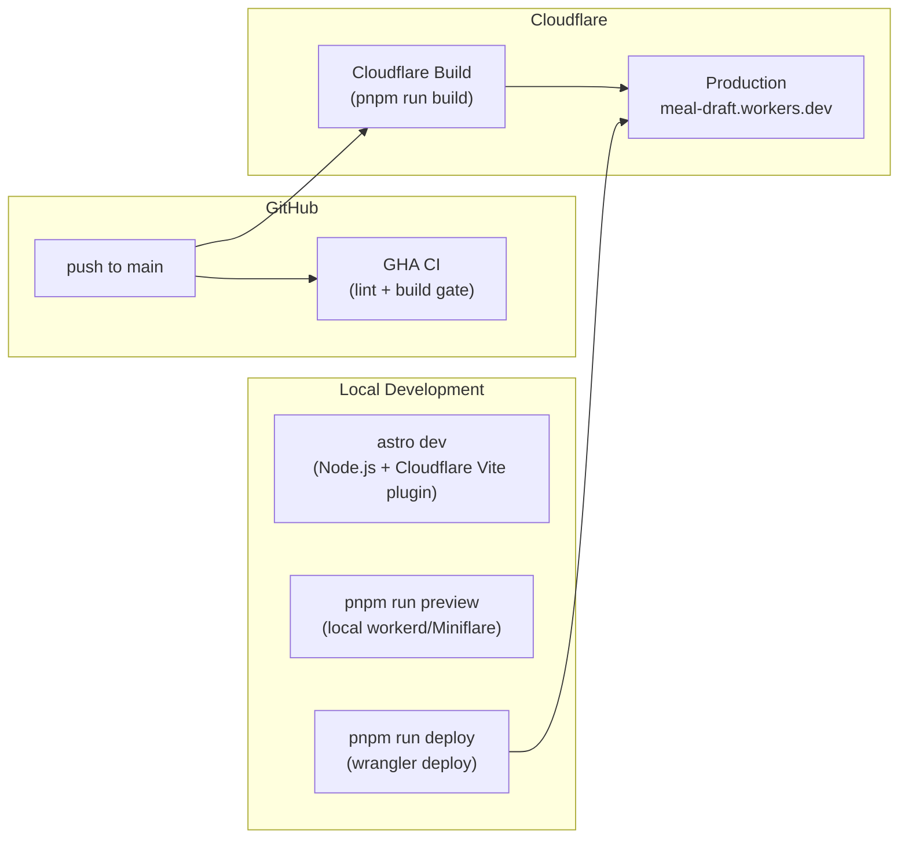
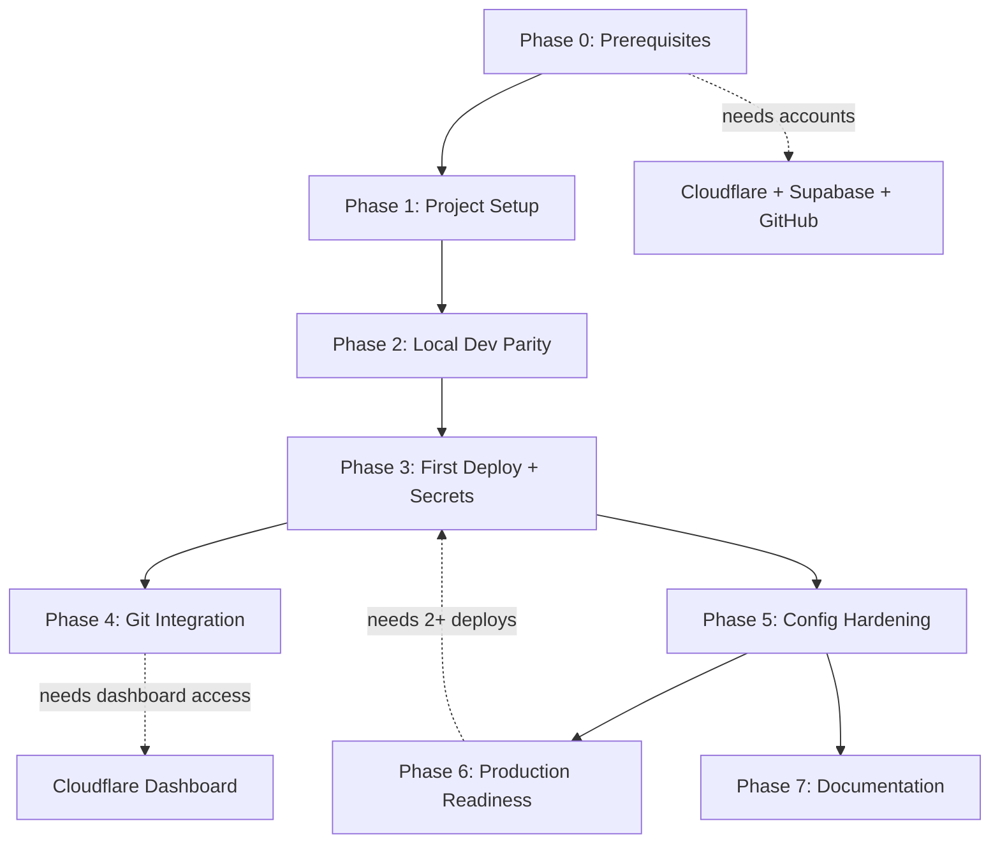

# Cloudflare Integration and Deployment Plan

This plan implements the deployment strategy from [infrastructure.md](../../foundation/infrastructure.md) for the stack defined in [tech-stack.md](../../foundation/tech-stack.md) (Astro 6 SSR, Cloudflare Workers, Supabase, pnpm, GitHub Actions CI).

**Status: COMPLETED (2026-05-26)**

Production URL: `https://meal-draft.bluemoon-labs.workers.dev`

---

## Final State

- Worker `meal-draft` deployed to Cloudflare Workers with auto-deploy on push to `main`
- Runtime secrets set via `wrangler secret put`: `SUPABASE_URL`, `SUPABASE_KEY`, `SUPABASE_SERVICE_ROLE_KEY`, `INVITE_CODE`, `OPENROUTER_API_KEY` (last three added post-initial deploy)
- Build-time env vars set in Cloudflare dashboard (`SUPABASE_URL`, `SUPABASE_KEY`, `NODE_VERSION`)
- CI runs pnpm lint + build on every push/PR to `main` (GitHub Actions)
- `wrangler.jsonc`: `compatibility_date: 2026-05-26`, flags: `nodejs_compat`, `global_fetch_strictly_public`
- `package.json`: `deploy` and `preview:wrangler` scripts, `packageManager` field
- `.dev.vars.example` template for Cloudflare-local secrets
- `AGENTS.md` and `README.md` updated with deployment docs

---

## Phase 0 -- Prerequisites

**Goal:** Ensure all external accounts, CLIs, and cloud projects are provisioned before touching code.

### 0A. Cloudflare Account

- [x] **0A.1** Create a free Cloudflare account at [dash.cloudflare.com](https://dash.cloudflare.com/)
- [x] **0A.2** Note your **Account ID** (found in the Cloudflare dashboard sidebar, or via `npx wrangler whoami`)

### 0B. Wrangler CLI Authentication

- [x] **0B.1** Wrangler CLI available locally (`npx wrangler --version`)
- [x] **0B.2** Authenticated with Cloudflare account:
  ```bash
  npx wrangler login
  ```
- [x] **0B.3** Verified with:
  ```bash
  npx wrangler whoami
  ```

**Edge case -- `wrangler login` fails behind corporate proxy or VPN:**
Use a manual API token instead. Generate one at [dash.cloudflare.com/profile/api-tokens](https://dash.cloudflare.com/profile/api-tokens) using the **"Edit Cloudflare Workers"** template. Then export it:

```bash
# PowerShell
$env:CLOUDFLARE_API_TOKEN = "your-token-here"
# Or persist in .dev.vars (gitignored) for local use
```

### 0C. Supabase Cloud Project

- [x] **0C.1** Supabase account created at [supabase.com/dashboard](https://supabase.com/dashboard)
- [x] **0C.2** Supabase project provisioned (dashboard > New Project)
- [x] **0C.3** Project credentials retrieved from **Project Settings > API**:
  - `SUPABASE_URL` = Project URL (e.g. `https://abcdefg.supabase.co`)
  - `SUPABASE_KEY` = `anon` `public` key

**Deferred -- Supabase CLI linking (not needed for deployment):**
Linking the local Supabase CLI (`npx supabase link`) and pushing migrations (`npx supabase db push`) are only required when you need to manage the remote database schema from the CLI. They are not prerequisites for Cloudflare deployment. Defer until your first migration is ready.

**Edge case -- Supabase project region vs. Cloudflare edge:**
Cloudflare Workers run at the edge closest to the user, but every Supabase call crosses the network to a single AWS region. This is fine for an MVP with a single-region user base. If latency matters later, consider Cloudflare Hyperdrive (connection pooler that caches Postgres connections at the edge).

### 0D. Node.js Toolchain

- [x] **0D.1** Switch to Node.js 22 LTS to match `.nvmrc` (`22.14.0`) and ensure parity across local, CI, and Cloudflare builds:
  ```bash
  nvm install 22.14.0
  nvm use
  node --version   # should print v22.14.0
  ```
  Node 22 is the active LTS line. Even if a newer version (e.g., 24.x) is installed locally, use 22 for this project to avoid subtle mismatches -- Cloudflare's build environment may not support Node 24 yet.
- [x] **0D.2** Ensure pnpm is installed globally:
  ```bash
  pnpm --version
  ```
  If not installed: `npm install -g pnpm` (or use `corepack enable` with Node 22).
- [x] **0D.3** Install dependencies:
  ```bash
  pnpm install
  ```
- [x] **0D.4** Verify the project builds successfully against the Cloudflare adapter:
  ```bash
  pnpm run build
  ```
  This must succeed before any deploy. If it fails on missing env vars, create a `.env` file from `.env.example` with your Supabase credentials from step 0C.3.

### 0E. Local Environment Files

- [x] **0E.1** Copy `.env.example` to `.env` (for `astro dev` which runs on Node.js):
  ```bash
  cp .env.example .env
  ```
  Fill in `SUPABASE_URL` and `SUPABASE_KEY` from step 0C.3.
- [x] **0E.2** Copy `.env.example` to `.dev.vars` (for `wrangler dev` / `astro preview` which runs on workerd):
  ```bash
  cp .env.example .dev.vars
  ```
  Fill in the same values. `.dev.vars` is already in `.gitignore`.

### 0F. Fix CI Workflow for pnpm

The existing `.github/workflows/ci.yml` uses `npm`, but the project uses **pnpm** (`pnpm-lock.yaml`). This must be fixed before the first deploy, otherwise CI and Cloudflare builds will diverge.

- [x] **0F.1** Update `.github/workflows/ci.yml`:

  ```yaml
  name: CI

  on:
    push:
      branches: [main]
    pull_request:
      branches: [main]

  jobs:
    ci:
      runs-on: ubuntu-latest
      steps:
        - uses: actions/checkout@v4
        - uses: pnpm/action-setup@v4
        - uses: actions/setup-node@v4
          with:
            node-version: 22
            cache: pnpm
        - run: pnpm install --frozen-lockfile
        - run: pnpm exec astro sync
        - run: pnpm run lint
        - run: pnpm run build
          env:
            SUPABASE_URL: ${{ secrets.SUPABASE_URL }}
            SUPABASE_KEY: ${{ secrets.SUPABASE_KEY }}
  ```

  Key changes: add `pnpm/action-setup@v4` step, switch `cache: npm` to `cache: pnpm`, replace `npm ci` with `pnpm install --frozen-lockfile`, replace `npm run` with `pnpm run`.

---

## Phase 1 -- Cloudflare Worker Setup and Secrets

**Goal:** Configure the Cloudflare Worker project name and production secrets. The Worker is auto-created on first `wrangler deploy` -- no manual project creation step needed.

- [x] **1.1** Rename `"name"` in `wrangler.jsonc` from `"10x-astro-starter"` to `"meal-draft"`
- [x] **1.2** Set production runtime secrets (completed in Phase 3.2):
  ```bash
  npx wrangler secret put SUPABASE_URL
  npx wrangler secret put SUPABASE_KEY
  ```
  Use the same values from Phase 0C.3. These are encrypted at rest and never visible after being set.
- [x] **1.3** Create a `.dev.vars.example` file mirroring `.env.example` so developers know where to put Cloudflare-local secrets:
  ```
  SUPABASE_URL=###
  SUPABASE_KEY=###
  ```

---

## Phase 2 -- Local Dev Parity

**Goal:** Ensure local development can test against the real workerd runtime, not just Vite/Node.js.

- [x] **2.1** Add convenience scripts to `package.json`:
  ```json
  "preview:wrangler": "astro build && wrangler dev",
  "deploy": "astro build && wrangler deploy"
  ```

  - `preview:wrangler` -- builds then runs local workerd via wrangler (true production parity)
  - `deploy` -- builds then deploys to Cloudflare (manual deploy path)
  - The existing `"preview": "astro preview"` already runs Miniflare via the Cloudflare adapter, so keep it
- [x] **2.2** _(Skipped -- not needed)_ `platformProxy` does not exist in `@astrojs/cloudflare` v13.5+. The adapter integrates `@cloudflare/vite-plugin` which provides workerd parity during `astro dev` automatically.
- [x] **2.3** Verify Supabase SSR works on workerd locally:
  ```bash
  pnpm run build && pnpm run preview
  ```
  Navigate to `http://localhost:4321/auth/signin` and confirm the page loads without runtime errors. Check terminal output for "dynamic require of stream" or similar workerd incompatibility messages.

**Edge case -- `@supabase/ssr` "dynamic require of stream" error:**
This is the most common Supabase + Workers failure ([supabase/supabase#37592](https://github.com/supabase/supabase/issues/37592)). Mitigations in order:

1. Confirm `"nodejs_compat"` is in `compatibility_flags` (already present in `wrangler.jsonc`)
2. Confirm `compatibility_date` is 2025 or later (currently `2026-05-26`)
3. If still failing, add `"nodejs_compat_v2"` flag (newer, stricter compat mode)
4. Last resort: pin `@supabase/ssr` to a known-good version and avoid upgrading without running `pnpm run preview` first

---

## Phase 3 -- First Production Deploy

**Goal:** Create the Worker on Cloudflare via the first manual deploy, set runtime secrets, and verify the live site works.

**Pre-requisite:** Merge all deployment-related changes to `main` before deploying. The first deploy should reflect the final state of the codebase (CI fix, wrangler rename, new scripts).

- [x] **3.1** Deploy to Cloudflare (this auto-creates the Worker named `meal-draft`):
  ```bash
  pnpm run deploy
  ```
  This runs `astro build && wrangler deploy`. On first run, wrangler creates the Worker automatically.
- [x] **3.2** Set production runtime secrets (now that the Worker exists):
  ```bash
  npx wrangler secret put SUPABASE_URL
  npx wrangler secret put SUPABASE_KEY
  ```
  Use the same values from Phase 0C.3. These are encrypted at rest and never visible after being set.
- [x] **3.3** Verify the deploy succeeded:
  - Cloudflare dashboard > Workers and Pages > meal-draft > Deployments -- should show a successful deployment
  - Visit `https://meal-draft.<account-subdomain>.workers.dev` (or whatever subdomain Cloudflare assigned)
- [x] **3.4** Smoke-test the live site:
  - Home page renders
  - `/auth/signin` page loads (confirms Supabase SSR client initializes on workerd)
  - Sign up / sign in flow works (confirms runtime secrets `SUPABASE_URL` and `SUPABASE_KEY` are available)
  - Protected route (`/dashboard`) redirects to signin when unauthenticated
- [x] **3.5** Check `wrangler tail` for any runtime errors:
  ```bash
  npx wrangler tail
  ```

**Edge case -- 500 errors on live site but local preview works:**
Most likely a missing runtime secret. Verify secrets are set with `npx wrangler secret list`. Remember: build-time env vars (set in dashboard under Build settings) and runtime secrets (set via `wrangler secret put`) are **different mechanisms**. The Astro env schema (`astro:env/server`) reads runtime secrets, not build-time vars. You need both:

- Build-time vars in dashboard (for the `astro build` step inside Cloudflare's builder)
- Runtime secrets via `wrangler secret put` (for the deployed Worker)

---

## Phase 4 -- Cloudflare Git Integration (Auto-Deploy)

**Goal:** Connect the GitHub repository to Cloudflare Workers so every push to `main` triggers an automatic production build and deploy -- handled entirely by Cloudflare, not GitHub Actions. The Worker must already exist (created in Phase 3).

Two deploy paths will be available after this phase:

- **Auto-deploy**: push/merge to `main` --> Cloudflare builds and deploys automatically
- **Manual deploy**: run `pnpm run deploy` from the local CLI

The existing `.github/workflows/ci.yml` remains a **lint + build gate only** -- it does **not** deploy. Cloudflare's own build pipeline handles deploy independently.

### Steps

- [x] **4.1** In the Cloudflare dashboard, go to **Workers and Pages > meal-draft > Settings > Builds and deployments**
- [x] **4.2** Connect your GitHub account and select the `meal-draft` repository
- [x] **4.3** Configure build settings:
  - **Production branch**: `main`
  - **Build command**: `pnpm run build`
  - Build output directory is read from `wrangler.jsonc` (`"directory": "./dist"`) -- no dashboard setting needed for Workers
- [x] **4.4** Set build variables in the Cloudflare build settings (these are **build-time** env vars, separate from the runtime secrets set in Phase 3.2):
  - `SUPABASE_URL` = your Supabase project URL (encrypt)
  - `SUPABASE_KEY` = your Supabase anon key (encrypt)
  - `NODE_VERSION` = `22.14.0` (matches `.nvmrc`; Cloudflare defaults to an old Node version without this)
- [x] **4.5** _(Skipped -- not applicable)_ Preview deployments are a Cloudflare Pages concept. Workers Git integration only deploys the configured production branch (`main`).
- [x] **4.6** Save and trigger a build to verify the auto-deploy pipeline works

**Edge case -- Cloudflare build vs. GitHub Actions CI race:**
Both Cloudflare and GHA will trigger on push to `main`. This is fine -- they are independent. GHA runs lint + build as a quality gate (fails the check, blocks future PRs). Cloudflare runs its own build + deploy. They do not conflict. If you want GHA to remain a required status check before merging PRs, configure branch protection rules in GitHub (Settings > Branches > `main` > Require status checks).

**Edge case -- Cloudflare build fails but GHA CI passes (or vice versa):**
The most likely cause is environment variable differences. Cloudflare's build uses env vars set in its dashboard (step 4.4), while GHA uses GitHub Secrets. Ensure both have identical `SUPABASE_URL` and `SUPABASE_KEY` values. The Node.js version can also diverge -- Cloudflare defaults to Node 12 unless `NODE_VERSION` is set.

**Edge case -- Cloudflare does not detect pnpm automatically:**
Cloudflare detects the package manager from the lock file. If `pnpm-lock.yaml` is present, it should use pnpm. If the build fails with npm-related errors, explicitly set the build command to `npx pnpm install --frozen-lockfile && pnpm run build`, or set the environment variable `NPM_FLAGS` to `--version` (a no-op that prevents npm install) and prepend `pnpm install &&` to the build command.

**Edge case -- first auto-deploy creates wrong production branch:**
When connecting Git, Cloudflare asks for the production branch. If you accidentally set it to `master` instead of `main` (or vice versa), fix it in Settings > Builds and deployments > Production branch. The project uses `main`.

---

## Phase 5 -- Wrangler Configuration Hardening

**Goal:** Address risk register items from infrastructure.md.

- [x] **5.1** Bump `compatibility_date` in `wrangler.jsonc` to `"2026-05-26"`. Document a quarterly bump cadence in `AGENTS.md`.
- [x] **5.2** Add a Cloudflare operations section to `AGENTS.md`:

  ```
  ## Cloudflare

  - Bump `compatibility_date` in `wrangler.jsonc` quarterly. Current: 2026-05-26.
  - Always run `pnpm run build && pnpm run preview` before deploying to catch workerd-only failures.
  - Never trust `astro dev` alone for runtime correctness -- it runs on Node.js, not workerd.
  - Production auto-deploys on push to `main` via Cloudflare Git integration.
  - Manual deploy: `pnpm run deploy`.
  ```

- [x] **5.3** Added `"global_fetch_strictly_public"` to `compatibility_flags` -- the app makes no internal service-binding fetches (all fetches go to external Supabase/OpenRouter APIs).

**Edge case -- `compatibility_date` regression after dependency update:**
If `pnpm update` pulls in a package that uses a Node.js API not available at the current `compatibility_date`, the build succeeds but `preview` crashes. Mitigation: always run `pnpm run preview` before pushing to `main` (which triggers auto-deploy). If a specific API is missing, bump `compatibility_date` to a more recent date.

---

## Phase 6 -- Production Readiness

**Goal:** Verify operational tooling and prepare for future custom domain.

- [x] **6.1** Verify rollback works: after at least 2 production deploys, test rollback:
  ```bash
  npx wrangler deployments list
  npx wrangler rollback
  ```
  Rollback is instant and atomic. Note: rollback is code-only -- Supabase schema migrations are **not** reverted.
- [x] **6.2** Set up production log streaming:
  ```bash
  npx wrangler tail
  ```
  Filter by status, method, or path as needed.
- [ ] **6.3** (Future) Add a custom domain in the Cloudflare dashboard under **Workers and Pages > meal-draft > Settings > Domains and Routes**. Cloudflare auto-provisions SSL.

**Edge case -- Supabase migration + code deploy ordering:**
Always deploy backwards-compatible migrations first (`npx supabase db push`), then push the code that depends on them to `main`. If a rollback is needed, the old code must still work with the new schema. Never deploy breaking schema changes and code in the same commit.

---

## Phase 7 -- Documentation and Operational Runbook

**Goal:** Ensure the deployment process is documented for the solo developer and future AI agents.

- [x] **7.1** Update `AGENTS.md` with the Cloudflare section from Phase 5.2 plus deploy commands
- [x] **7.2** Add deploy instructions to the project README, covering:
  - Prerequisites (accounts, CLI auth, Supabase project)
  - Local environment setup (`.env`, `.dev.vars`)
  - Manual deploy command (`pnpm run deploy`)
  - Auto-deploy flow (push to `main` = Cloudflare production deploy)
  - Rollback procedure
  - Secret rotation procedure (`wrangler secret put` overwrites immediately)
- [x] **7.3** Verify `.dev.vars` and `.wrangler/` remain in `.gitignore`

---

## Files Changed Summary

- `wrangler.jsonc` -- renamed project to `meal-draft`, bumped `compatibility_date` to `2026-05-26`, added `global_fetch_strictly_public` flag
- `package.json` -- added `deploy`, `preview:wrangler` scripts and `packageManager` field
- `.github/workflows/ci.yml` -- fixed for pnpm (`pnpm/action-setup@v4`, `cache: pnpm`, `pnpm install --frozen-lockfile`), switched branches to `main`, added `FORCE_JAVASCRIPT_ACTIONS_TO_NODE24`
- `.dev.vars.example` -- new file (mirrors `.env.example`)
- `AGENTS.md` -- added Cloudflare operations section, fixed Commands to use pnpm, added deploy commands
- `README.md` -- rewritten for MealDraft with deployment, rollback, secrets, and dev/prod parity docs
- `context/foundation/tech-stack.md` -- fixed `deployment_target` from `cloudflare-pages` to `cloudflare-workers`
- `context/foundation/infrastructure.md` -- fixed Getting Started CLI commands from `pages` to Workers

---

## Deploy Architecture



---

## Phase Dependency Graph



All phases completed on 2026-05-26. Only 6.3 (custom domain) remains as a future task.
