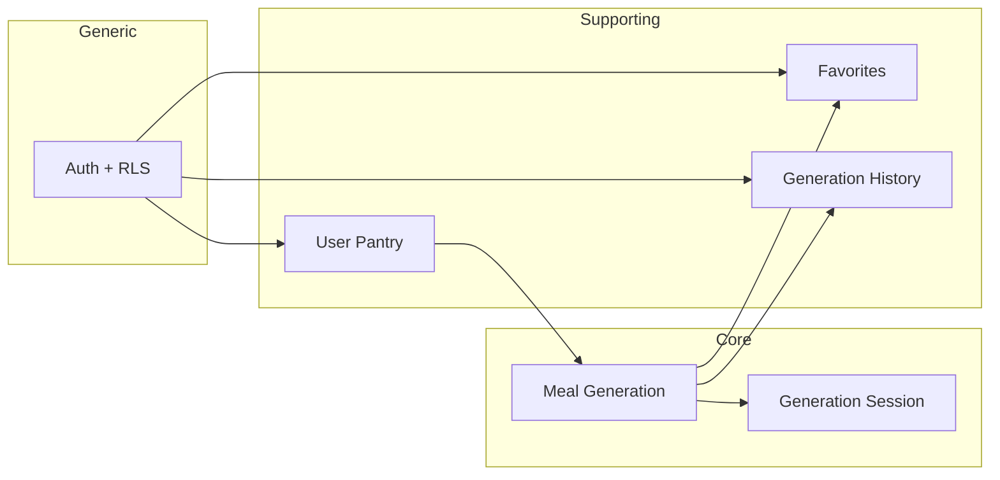

# MealDraft — destylacja domeny

> Metoda: odkrycie → analiza → klasyfikacja. Źródła: `context/foundation/prd.md`, `roadmap.md`, `shape-notes.md`, `tech-stack.md`, `README.md`, migracje Supabase, kod aplikacji. Brak osobnego katalogu `docs/` — dokumentacja wymagań żyje w `context/foundation/`.

---

## KROK 0 — Kontekst projektu

### Produkt i problem

MealDraft to responsywna aplikacja webowa dla zapracowanych dorosłych stojących przed lodówką z pytaniem „co ugotować na teraz?”. W odróżnieniu od aplikacji z listą przepisów, produkt zwraca **dokładnie jedną** propozycję posiłku spełniającą twarde ograniczenia (spiżarnia, czas, typ posiłku), z opcją **Inny przepis** wykluczającą wcześniejsze wyniki w sesji.

**Cytat:** `context/foundation/prd.md:21-23` — triple problem (decision paralysis, skill gap, food waste); istniejące aplikacje zwracają listy i traktują ograniczenia jako sugestie.

**North star (roadmap):** `context/foundation/roadmap.md:24-28` — użytkownik: spiżarnia → ograniczenia → jeden zgodny posiłek (S-03 done).

### Stack i struktura repo

| Warstwa                         | Lokalizacja                                                                       | Rola biznesowa                                                                       |
| ------------------------------- | --------------------------------------------------------------------------------- | ------------------------------------------------------------------------------------ |
| UI (SSR + islands)              | `src/pages/`, `src/components/`                                                   | Spiżarnia (`PantryWidget`), generator (`MealGenerator`), ulubione (`FavoritesShell`) |
| API                             | `src/pages/api/`                                                                  | `pantry`, `generate`, `favorites`, `auth`                                            |
| Logika biznesowa (proceduralna) | `src/lib/generation.ts`, `src/lib/pantry-name.ts`, `src/lib/generation-schema.ts` | Orkiestracja generowania, walidacja wejścia, copy PL                                 |
| Typy / DTO                      | `src/types.ts`                                                                    | `PantryProduct`, `MealRecipe`, `FavoriteMeal`, `GenerationHistoryEntry`              |
| Persystencja + reguły DB        | `supabase/migrations/`                                                            | Tabele, RLS, trigger przycinania historii, unikalność nazw                           |
| Auth / brama prywatności        | `src/middleware.ts`, `src/lib/supabase.ts`                                        | Sesja cookie, `PROTECTED_ROUTES`                                                     |

**Stack:** Astro 6 SSR, React 19 islands, Tailwind 4, Supabase (auth + Postgres + RLS), Cloudflare Workers, OpenRouter/AI SDK (`tech-stack.md:24-35`, `README.md:7-14`).

**Brak warstwy domenowej:** encje to interfejsy TypeScript i wiersze SQL; reguły biznesowe są rozproszone między prompt LLM, walidację Zod i trigger DB — nie ma agregatów jako obiektów.

### Stan implementacji vs roadmap

| Obszar                         | Dokument      | Kod                                                                                        |
| ------------------------------ | ------------- | ------------------------------------------------------------------------------------------ |
| Schema + RLS (F-01)            | done          | `20260528120000_domain_data_schema.sql`                                                    |
| Generowanie AI (F-02, S-03)    | done          | `src/lib/generation.ts`, `POST /api/generate`                                              |
| Spiżarnia CRUD (S-02)          | done          | `src/pages/api/pantry/`, `PantryWidget.tsx`                                                |
| Inny przepis (S-04)            | done          | `MealGenerator.tsx` (`shownNames`, `exclude_names`)                                        |
| Ulubione (S-05)                | done          | `src/pages/api/favorites/`                                                                 |
| Historia generowania UI (S-06) | **cancelled** | zapis w DB pozostaje; strona/API listy — deferred post-MVP (ulubione pełnią rolę historii) |

---

## KROK 1 — Ubiquitous Language

Terminy w kolejności odkrycia. Definicje oparte na dokumentach; lokalizacja w kodzie zweryfikowana.

| Termin (PL / EN)                              | Definicja                                                                                                         | Cytat źródłowy                                                                                            | Kod                                                                                                                                                          |
| --------------------------------------------- | ----------------------------------------------------------------------------------------------------------------- | --------------------------------------------------------------------------------------------------------- | ------------------------------------------------------------------------------------------------------------------------------------------------------------ |
| **Spiżarnia / Pantry**                        | Wirtualna lista produktów użytkownika (nazwy składników), ręcznie zarządzana; wejście do generowania              | PRD US-02: `context/foundation/prd.md:65-76` — add/edit/remove, persist across sessions                   | `PantryProduct` `src/types.ts:10-16`; tabela `pantry_products` `20260528120000_domain_data_schema.sql:9-15`; UI `PantryWidget.tsx:65`                        |
| **Produkt spiżarni / Pantry product**         | Pojedynczy składnik identyfikowany nazwą (v1 bez ilości/ważności)                                                 | PRD FR-003–006: `prd.md:138-145`                                                                          | API POST `src/pages/api/pantry/index.ts:62-64`; unikalność `(user_id, lower(trim(name)))` `20260528120000_domain_data_schema.sql:17-18`                      |
| **Strict Pantry / tryb ścisłej spiżarni**     | Kontrakt v1: wygenerowany posiłek **nigdy** nie zawiera składników spoza zadeklarowanej spiżarni; zero tolerancji | PRD Guardrails: `prd.md:43-44`; Business Logic: `prd.md:177-178` — „no ingredient substitution”           | Prompt + walidacja `src/lib/generation.ts:67,238-259`; **rozszerzenie:** allowlist `COOKING_STAPLES` `generation.ts:9-31,67,241`                             |
| **Podstawy kuchenne / Cooking staples**       | Składniki uniwersalne (sól, olej, mąka…) dozwolone w przepisie mimo braku wpisu w spiżarni                        | Plan F-02: `context/changes/ai-meal-generation/plan-brief.md:35` — „Soft — server-side staples allowlist” | `COOKING_STAPLES` `src/lib/generation.ts:9-31`; walidacja `generation.ts:238-241`                                                                            |
| **Ograniczenia generowania / Constraints**    | Typ posiłku + budżet czasu (presety); filtry nienegocjowalne                                                      | PRD FR-007–008: `prd.md:149-152`; Success Criteria: `prd.md:35`                                           | `GenerateRequest` `src/types.ts:36-40`; UI presety `MealGenerator.tsx:26-31,363-403`                                                                         |
| **Budżet czasu / Time budget**                | Maksymalny czas przygotowania; presety 15/30/60 min lub „Dowolny czas” (`null`)                                   | PRD FR-007: `prd.md:149`; resolved S-03: `roadmap.md:187`                                                 | `max_prep_time_minutes` `generation-schema.ts:5`; etykieta „Dowolny czas” `MealGenerator.tsx:30`                                                             |
| **Typ posiłku / Meal type**                   | Enum: śniadanie / obiad / kolacja (`breakfast` / `lunch` / `dinner`)                                              | PRD FR-008: `prd.md:151-152`                                                                              | `MealType` `src/types.ts:1`; enum DB `20260528120000_domain_data_schema.sql:3`                                                                               |
| **Propozycja posiłku / Meal suggestion**      | Dokładnie jeden wynik: nazwa, czas, składniki, kroki                                                              | PRD US-01: `prd.md:52-56`                                                                                 | `MealRecipe` `src/types.ts:3-8`; odpowiedź API `generate.ts:57`                                                                                              |
| **Generowanie / Generate**                    | Operacja wyboru jednego posiłku z pantry + constraints                                                            | PRD Business Logic: `prd.md:175-181`                                                                      | `generateMeal()` `src/lib/generation.ts:140-291`; endpoint `src/pages/api/generate.ts:54`                                                                    |
| **Brak dopasowania / no_match**               | Stan gdy nie ma bezpiecznego przepisu; info panel, HTTP 200, bez zapisu historii sukcesu                          | PRD US-01 AC: `prd.md:62`; wire `generation-schema.ts:22-25`                                              | `generation.ts:216-223,259`; API `generate.ts:60-61`; UI `MealGenerator.tsx:465-477`                                                                         |
| **Sesja generowania / Generation session**    | Zakres klienta, w którym „Inny przepis” wyklucza wcześniejsze nazwy dań                                           | PRD US-06, Secondary Success: `prd.md:39,115-125`                                                         | `shownNames` `MealGenerator.tsx:93,220-241`; `exclude_names` w request `MealGenerator.tsx:173`                                                               |
| **Inny przepis / Try another**                | Żądanie kolejnej propozycji z listą wykluczeń                                                                     | PRD FR-010: `prd.md:155-156`; etykieta PL `generation-copy.ts:17`                                         | `handleTryAnother` `MealGenerator.tsx:232-241`; prompt user message `generation.ts:178-182`                                                                  |
| **Wyczerpanie propozycji / Exhaustion**       | Brak kolejnego przepisu w sesji; komunikat z podpowiedziami (czas, typ posiłku)                                   | PRD US-06 AC: `prd.md:123-125`                                                                            | `feedback === "exhausted"` `MealGenerator.tsx:205-207,450-462`; copy `generation-copy.ts:23-31`                                                              |
| **Ulubione / Favorites**                      | Celowe zakładki przepisów (snapshot), niezależne od aktualnej spiżarni                                            | PRD US-03, FR-011: `prd.md:78-88,160-161`; roadmap S-05: `roadmap.md:155`                                 | `favorite_meals` `20260528120000_domain_data_schema.sql:41-54`; API `favorites/index.ts:61-64`                                                               |
| **Historia generowania / Generation history** | Pasywny log ostatnich N wygenerowanych posiłków (read-only w PRD)                                                 | PRD US-04, FR-013: `prd.md:90-100,164-165`                                                                | INSERT przy sukcesie `generation.ts:263-271`; trigger N=20 `20260528120000_domain_data_schema.sql:77-104`; typ `GenerationHistoryEntry` `src/types.ts:26-34` |
| **Konto użytkownika / User account**          | Płaski model; dane prywatne per konto; brak gościa                                                                | PRD Access Control: `prd.md:185-186`                                                                      | `middleware.ts:6-37`; RLS `(select auth.uid()) = user_id` `20260528120000_domain_data_schema.sql:114-167`                                                    |
| **Wyposażenie kuchni / Equipment**            | Ograniczenie wymienione w wizji produktu                                                                          | PRD Vision: `prd.md:23` — „available equipment… non-negotiable filters”                                   | **BRAK w kodzie** — świadomie wycięte: `shape-notes.md:28-29` — „cut… equipment filtering for v1”                                                            |
| **Strategia Minimum Missing**                 | Przyszła strategia generowania z własnymi regułami                                                                | PRD Guardrails: `prd.md:43` — „Future strategies (e.g. Minimum Missing)”                                  | **BRAK w kodzie**                                                                                                                                            |

---

## KROK 2 — Klasyfikacja subdomen

| Obszar / pojęcie                                               | Core | Supporting | Generic | Uzasadnienie (cele produktu)                                                                                                  |
| -------------------------------------------------------------- | :--: | :--------: | :-----: | ----------------------------------------------------------------------------------------------------------------------------- |
| **Silnik decyzyjny** (1 odpowiedź, strict pantry, constraints) |  ✓   |            |         | North star i Primary Success Criteria (`roadmap.md:24`, `prd.md:35`) — „nie kolejna aplikacja z listą przepisów”              |
| **Strict Pantry + walidacja składników**                       |  ✓   |            |         | Guardrail zero tolerancji (`prd.md:43-44`) — przewaga vs SuperCook/Tasty                                                      |
| **Sesja „Inny przepis” / wykluczenia**                         |  ✓   |            |         | Secondary Success Criterion (`prd.md:39`) — produkt ma alternatywę bez powrotu do listy                                       |
| **Ograniczenia czasu i typu posiłku**                          |  ✓   |            |         | FR-007–009, Business Logic (`prd.md:149-154,177-179`)                                                                         |
| **Zarządzanie spiżarnią (CRUD)**                               |      |     ✓      |         | Konieczne wejście do core loop (US-02), ale nie różnicuje produktu vs notes app (Socrates FR-004, `prd.md:141`)               |
| **Ulubione**                                                   |      |     ✓      |         | Celowe zakładki (FR-011); snapshot niezależny od spiżarni (`roadmap.md:155`)                                                  |
| **Historia generowania**                                       |      |     ✓      |         | Pasywny log (FR-013); zapis w DB istnieje; UI/API listy — cancelled (S-06), ulubione pełnią rolę historii w MVP v1            |
| **Uwierzytelnianie + izolacja danych**                         |      |            |    ✓    | Środek do prywatności (Access Control `prd.md:185-186`); email+password to decyzja implementacyjna v1, nie tożsamość produktu |
| **Rate limiting generowania**                                  |      |            |    ✓    | Ochrona infrastruktury; brak w PRD — `generate.ts:7-8,50-52`                                                                  |
| **UI / copy po polsku**                                        |      |            |    ✓    | NFR (`prd.md:169`); prezentacja, nie reguła domenowa                                                                          |

**Rdzeń domeny (Core Domain):** _Constraint-bound meal decision_ — jedna propozycja posiłku w ramach spiżarni (plus uzgodnione wyjątki), czasu i typu, z sesyjnym odrzucaniem poprzednich wyników.

---

## KROK 3 — Kandydaci na agregaty i niezmienniki

Model docelowy (koncepcyjny — nie odzwierciedlony jako obiekty w kodzie).

### 1. User Pantry (Spiżarnia użytkownika)

|                      |                                                                                  |
| -------------------- | -------------------------------------------------------------------------------- | ---------------------------------------------------------------------------------------- |
| **Granica**          | Wszystkie `pantry_products` jednego `user_id`                                    |
| **Niezmiennik**      | Nazwa produktu unikalna w obrębie konta (case-insensitive, trim)                 | Źródło: implikacja US-02 + unikalny indeks `20260528120000_domain_data_schema.sql:17-18` |
| **Niezmiennik**      | Tylko właściciel może czytać/mutować swoją spiżarnię                             | PRD Access Control `prd.md:171-172`; RLS `20260528120000_domain_data_schema.sql:114-137` |
| **Status egzekucji** | **Egzekwuje** — DB unique index + RLS; API `.eq("user_id")` `pantry/index.ts:27` |

### 2. Meal Generation (Propozycja posiłku — use case / proces)

|                      |                                                                                                                                     |
| -------------------- | ----------------------------------------------------------------------------------------------------------------------------------- | -------------------------------------------------------------------------------------------------------------------------------- |
| **Granica**          | Jedno wywołanie `generateMeal`: odczyt spiżarni → LLM → walidacja → opcjonalny zapis historii                                       |
| **Niezmiennik**      | Każdy składnik przepisu ∈ spiżarnia ∪ dozwolone podstawy kuchenne                                                                   | PRD Guardrails `prd.md:43-44`; kod `generation.ts:238-259` (**uwaga:** podstawy kuchenne rozszerzają PRD „ONLY declared pantry”) |
| **Niezmiennik**      | `prep_time_minutes ≤ max_prep_time_minutes` gdy limit ustawiony                                                                     | PRD Guardrails `prd.md:44`; Success Criteria `prd.md:35`                                                                         |
| **Status egzekucji** | **Deklaruje (prompt), nie egzekwuje w kodzie** — warunek tylko w `buildSystemPrompt` `generation.ts:85-86`; brak walidacji po parse |
| **Niezmiennik**      | Dokładnie jedna propozycja na wywołanie (nie lista)                                                                                 | PRD `prd.md:23,179-181`                                                                                                          |
| **Status egzekucji** | **Egzekwuje** — architektura API i UI (pojedynczy `MealRecipe`)                                                                     |
| **Niezmiennik**      | Przy `no_match` brak udanego przepisu dla klienta; bez insertu sukcesu do historii                                                  | Plan F-02 `ai-meal-generation/plan-brief.md:25`; kod `generation.ts:216-223` (early return bez insert)                           |
| **Status egzekucji** | **Egzekwuje**                                                                                                                       |
| **Niezmiennik**      | Pusta spiżarnia → natychmiastowy `no_match` (bez LLM)                                                                               | Plan F-02 `plan-brief.md:40`; kod `generation.ts:161-168`                                                                        |
| **Status egzekucji** | **Egzekwuje**                                                                                                                       |

### 3. Generation Session (Sesja „Inny przepis”)

|                      |                                                                                                                                                                                  |
| -------------------- | -------------------------------------------------------------------------------------------------------------------------------------------------------------------------------- | ------------------------------------------------------------------------------- |
| **Granica**          | Stan klienta od „Generuj” do resetu; lista `exclude_names`                                                                                                                       |
| **Niezmiennik**      | Żaden wynik nie powtarza nazwy już pokazanej w sesji                                                                                                                             | PRD US-06 `prd.md:121-123`; Secondary `prd.md:39`                               |
| **Status egzekucji** | **Częściowo** — klient buduje listę `MealGenerator.tsx:235-239`; serwer przekazuje do LLM `generation.ts:178-182`; **brak** server-side check czy zwrócona nazda ∉ exclude_names |
| **Niezmiennik**      | Limit odrzuceń w sesji (cap)                                                                                                                                                     | FR-010 + schema max 20 `generation-schema.ts:6`; UI `MealGenerator.tsx:105,407` |
| **Status egzekucji** | **Egzekwuje** (klient + Zod max 20)                                                                                                                                              |

### 4. Favorite Meals (Ulubione)

|                      |                                                                                                |
| -------------------- | ---------------------------------------------------------------------------------------------- | -------------------------------------------------------------------------------------------------------------------- |
| **Granica**          | `favorite_meals` per user                                                                      |
| **Niezmiennik**      | Snapshot przepisu (name, time, ingredients, steps) zapisany w momencie ulubienia               | US-03 AC `prd.md:86`; CHECK JSON `20260528120000_domain_data_schema.sql:46-53`                                       |
| **Niezmiennik**      | Duplikat tej samej nazwy przepisu obsłużony gracefully                                         | US-03 AC `prd.md:87`; unique index `20260528120000_domain_data_schema.sql:56-57`; API 409 `favorites/index.ts:68-69` |
| **Niezmiennik**      | Ulubione niezależne od aktualnej spiżarni                                                      | Open Question PRD `prd.md:200`; roadmap `roadmap.md:188`                                                             |
| **Status egzekucji** | **Egzekwuje** — brak walidacji składników vs pantry przy zapisie (zgodnie z intencją bookmark) |

### 5. Generation History (Historia)

|                      |                                                                                                                                                             |
| -------------------- | ----------------------------------------------------------------------------------------------------------------------------------------------------------- | ----------------------------------------------------------------------------------------------- |
| **Granica**          | Wiersze `generation_history` per user                                                                                                                       |
| **Niezmiennik**      | Retencja ostatnich N wpisów (N=20 w migracji)                                                                                                               | FR-013 + Open Question `prd.md:164,199`; trigger `20260528120000_domain_data_schema.sql:77-104` |
| **Niezmiennik**      | Read-only dla użytkownika (brak edycji/usuwania w PRD)                                                                                                      | US-04 AC `prd.md:100`                                                                           |
| **Status egzekucji** | **Egzekwuje (retencja)**; **brak UI/API read** — GRANT tylko SELECT/INSERT `20260528120000_domain_data_schema.sql:175`; brak strony historii w `src/pages/` |
| **Niezmiennik**      | Wpis tylko przy udanym generowaniu (+ sentinel przy błędzie infra)                                                                                          | `generation.ts:263-271`, `insertFailureSentinelRow` `generation.ts:98-126`                      |

---

## KROK 4 — Rozjazdy MODEL (dokumenty) vs KOD

| #   | Dokument mówi (X)                                                                                 | Kod robi (Y)                                                                                                                                   | Dowód                                                                                                   |
| --- | ------------------------------------------------------------------------------------------------- | ---------------------------------------------------------------------------------------------------------------------------------------------- | ------------------------------------------------------------------------------------------------------- |
| 1   | Strict Pantry: składniki **tylko** z zadeklarowanej spiżarni, zero tolerancji (`prd.md:43-44,60`) | Dozwolone dodatkowo `COOKING_STAPLES` (sól, olej, mąka…) bez wpisu w spiżarni                                                                  | `generation.ts:9-31,67,238-241`; plan F-02 świadomie: `ai-meal-generation/plan-brief.md:35`             |
| 2   | Wygenerowany posiłek **zawsze** respektuje limit czasu (`prd.md:44,61`)                           | Limit czasu tylko w prompcie LLM; brak odrzucenia gdy `prep_time_minutes > max`                                                                | Prompt `generation.ts:85-86`; brak check po `MealRecipeSchema.parse` `generation.ts:227-260`            |
| 3   | Vision: ograniczenia obejmują też **wyposażenie** (`prd.md:23`)                                   | Brak filtra wyposażenia                                                                                                                        | **BRAK w kodzie**; wycięte v1: `shape-notes.md:28-29`                                                   |
| 4   | Użytkownik przegląda historię ostatnich N posiłków (US-04, FR-013)                                | Historia zapisywana przy sukcesie; brak widoku/API listy — S-06 cancelled; ulubione pełnią rolę historii w MVP v1                              | INSERT `generation.ts:263-271`; brak `src/pages/*history*`; S-06 cancelled `roadmap.md`                 |
| 5   | „Try another” nie powtarza wcześniejszych wyników w sesji (`prd.md:121-123`)                      | Wykluczenia jako sugestia w promptcie LLM; serwer nie weryfikuje unikalności nazwy vs `exclude_names`                                          | `generation.ts:178-182`; brak walidacji po parse                                                        |
| 6   | PRD Open Question: wartość N dla historii nieustalona (`prd.md:199`)                              | N=20 zhardkodowane w triggerze DB                                                                                                              | `20260528120000_domain_data_schema.sql:77`                                                              |
| 7   | Business Logic: „no ingredient substitution” (`prd.md:177-178`)                                   | LLM instruowany „use EXACTLY as in pantry list” + retry przy violation; dopasowanie **stringowe** (lower/trim), bez kanonicznych ID składników | `generation.ts:66,172,238-241`; `v2-ideas.md:20-21`                                                     |
| 8   | Ograniczenia traktowane jako filtry nienegocjowalne end-to-end                                    | Typ posiłku tylko w prompcie; brak server-side walidacji kategorii posiłku vs output                                                           | `generation.ts:82-83`; brak post-validation                                                             |
| 9   | Test plan: strict-pantry validation jako wysokie ryzyko (#2)                                      | Faza integracji generacji ze mockiem LLM: **not started**                                                                                      | `context/foundation/test-plan.md:72,208`                                                                |
| 10  | Encje domenowe (Pantry, Recipe, History)                                                          | Anemic DTO + procedury w `src/lib/`; brak agregatów, brak katalogu `domain/`                                                                   | `src/types.ts`; `src/lib/generation.ts`                                                                 |
| 11  | Ulubione: meal_type przy zapisie                                                                  | `meal_type` z UI bieżących constraintów generatora, nie z historii generowania                                                                 | `MealGenerator.tsx:249-257`; kolumna `meal_type` migracja `20260605120000_favorite_meals_meal_type.sql` |

---

## KROK 5 — Ranking refaktoru (agregaty / granice)

Ocena: **wartość rdzeniowa** (1–5) × **luka egzekucji** (1–5). Im wyższy iloczyn, tym pilniejszy refaktor.

| #     | Kandydat                                                         | Wartość | Ryzyko (słaba egzekucja) | Iloczyn | Uwagi                                                                                 |
| ----- | ---------------------------------------------------------------- | ------- | ------------------------ | ------- | ------------------------------------------------------------------------------------- |
| **1** | **Meal Generation** (proces + reguły strict pantry / czas / typ) | 5       | 4                        | **20**  | Najważniejszy kontrakt produktu; dziś rozproszony między prompt a częściową walidację |
| 2     | Generation Session (wykluczenia sesyjne)                         | 4       | 4                        | 16      | Zależność od LLM; brak server-side enforcement powtórzeń                              |
| 3     | User Pantry                                                      | 3       | 1                        | 3       | Dobrze egzekwowany przez DB+RLS; refaktor głównie strukturalny                        |
| 4     | Generation History                                               | 3       | 3                        | 9       | Retencja OK; brak read model / UI (S-06)                                              |
| 5     | Favorite Meals                                                   | 2       | 1                        | 2       | Stabilny snapshot; niski priorytet refaktoru domenowego                               |

### Rekomendacja #1: **Meal Generation jako jawny bounded context**

**Dlaczego:** North star i guardrails produktu stoją na tym, czy użytkownik dostaje **jeden wiarygodny** posiłek w granicach spiżarni i czasu (`prd.md:35,43-44`). Kod już ma szkielet (`generateMeal`), ale **niezmienniki czasu i pełnej zgodności typu posiłku są deklarowane w prompcie, nie w domain service**. Rozszerzenie o `COOKING_STAPLES` jest świadomą decyzją implementacyjnej, lecz **nigdzie nie jest zunifikowana z językiem PRD „ONLY declared pantry”** — to źródło rozjazdu model↔kod i przyszłych bugów (np. LLM zwraca 45 min przy limicie 30).

**Kierunek refaktoru (bez kodu):**

1. Wydzielić **Policy** „AllowedIngredients = Pantry ∪ StaplesPolicy” z jednym źródłem prawdy i testami jednostkowymi.
2. Dodać **post-conditions** po LLM: czas, składniki, opcjonalnie meal type — retry/`no_match` jak dziś dla pantry violation.
3. Traktować **Generation Session exclusions** jako część tego samego use case (walidacja nazwy vs `exclude_names`).
4. Utrzymać **Pantry** i **Favorites** jako osobne agregaty persystencji; generowanie jako **domain service** konsumujący read model spiżarni.

---

## Mapa kontekstów (skrót)

---

## Ograniczenia tej destylacji

- Nie analizowano pełnego diffu wszystkich plików `context/changes/` — tylko wybrane change notes i research wspierające rozjazdy.
- Testy integracyjne generacji (mock LLM) nie istnieją w repo (`test-plan.md:72,208`); status egzekucji oparty na inspekcji kodu produkcyjnego.
- Data dokumentu: stan repo po S-05 (favorites). S-06 (history UI) cancelled dla MVP v1 — ulubione pełnią rolę historii.
