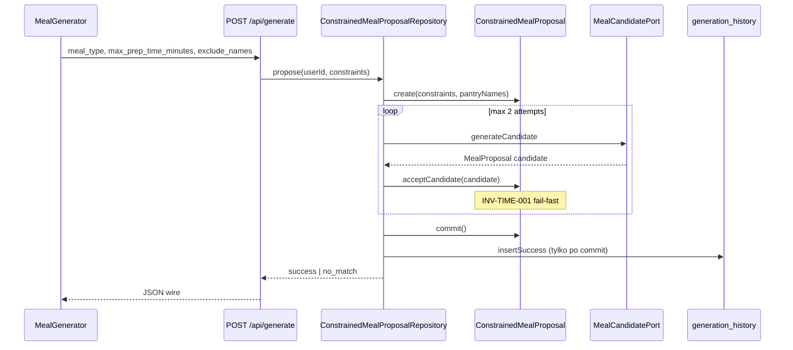

# Plan refaktoru: agregat-strażnik niezmiennika budżetu czasu

> Metoda: odkrycie → identyfikacja → klasyfikacja → diagnoza → projekt.  
> Zakres: **plan only** — bez zmian w kodzie produkcyjnym.  
> Powiązanie: @context/domain/01-domain-distillation.md

---

## KROK 0 — Kontekst

### Dokumenty wymagań

| Dokument                                   | Rola                                                                  |
| ------------------------------------------ | --------------------------------------------------------------------- |
| `context/foundation/prd.md`                | Success Criteria, Guardrails, Business Logic, US-01/06, FR-007–010    |
| `context/foundation/roadmap.md`            | North star S-03, stan slice'ów (S-03–S-05 done, S-06 proposed)        |
| `context/foundation/test-plan.md`          | Risk #2 strict-pantry; Phase 3 generation server path **not started** |
| `context/domain/01-domain-distillation.md` | Mapa domeny, rozjazdy MODEL vs KOD                                    |

### Stack i warstwy logiki biznesowej

| Warstwa                 | Ścieżka                                                      | Co robi dziś                                                           |
| ----------------------- | ------------------------------------------------------------ | ---------------------------------------------------------------------- |
| UI                      | `src/components/meal/MealGenerator.tsx`                      | Presety czasu, wywołanie API, render `prep_time_minutes` bez walidacji |
| API (cienka)            | `src/pages/api/generate.ts`                                  | Auth, rate limit, Zod wejścia, delegacja do `generateMeal`             |
| „Serwis” (proceduralny) | `src/lib/generation.ts`                                      | Orkiestracja LLM + częściowa walidacja składników + zapis historii     |
| Kontrakt wire           | `src/lib/generation-schema.ts`, `parse-generate-response.ts` | Kształt JSON; **nie** egzekwuje relacji czas ↔ constraint              |
| Persystencja            | `supabase/migrations/`, Supabase client                      | `pantry_products`, `generation_history`; brak reguł czasu w DB         |
| Typy                    | `src/types.ts`                                               | Anemic DTO (`MealRecipe`, `GenerateRequest`)                           |

**Stack:** Astro 6 SSR, React 19, Supabase, Cloudflare Workers, OpenRouter (`tech-stack.md:24-35`).

---

## KROK 1 — Niezmienniki biznesowe

Reguły, które **muszą** być prawdziwe, odkryte w dokumentach i kodzie.

| ID                | Niezmiennik (reguła)                                                                                  | Źródło dokument                                                                                             | Kod (dowód)                                                                                      | Status dziś                                |
| ----------------- | ----------------------------------------------------------------------------------------------------- | ----------------------------------------------------------------------------------------------------------- | ------------------------------------------------------------------------------------------------ | ------------------------------------------ |
| **INV-TIME-001**  | Gdy `max_prep_time_minutes !== null`, udana propozycja ma `prep_time_minutes ≤ max_prep_time_minutes` | Guardrails `prd.md:44`; US-01 AC `prd.md:61`; Success Criteria `prd.md:35`; Business Logic `prd.md:177-179` | Prompt tylko: `generation.ts:85-86`; brak check po parse `generation.ts:227-281`                 | **Deklarowany** (LLM)                      |
| INV-PANTRY-001    | Każdy składnik udanego przepisu ∈ spiżarnia użytkownika ∪ uzgodniony allowlist podstaw kuchennych     | Guardrails `prd.md:43-44`; US-01 AC `prd.md:60`                                                             | Walidacja `generation.ts:238-259`; allowlist `generation.ts:9-31`                                | **Egzekwowany** (serwer, retry→`no_match`) |
| INV-PANTRY-002    | Pusta spiżarnia → brak propozycji (`no_match`), bez wywołania LLM                                     | Plan F-02 `ai-meal-generation/plan-brief.md:40`                                                             | `generation.ts:161-168`                                                                          | **Egzekwowany**                            |
| INV-OUTPUT-001    | Dokładnie jedna propozycja na wywołanie API (nie lista)                                               | PRD `prd.md:23,179-181`                                                                                     | Pojedynczy `MealRecipe` w odpowiedzi `generate.ts:57`                                            | **Egzekowany** (kształt API)               |
| INV-NOMATCH-001   | Przy `no_match` klient nie dostaje udanego przepisu; brak insertu sukcesu do historii                 | US-01 AC `prd.md:62`; plan F-02 `plan-brief.md:25`                                                          | Early return `generation.ts:216-223`; brak insert przed `263-271`                                | **Egzekowany**                             |
| INV-SESSION-001   | W sesji „Inny przepis” nazwa propozycji ∉ `exclude_names`                                             | Secondary Success `prd.md:39`; US-06 `prd.md:121-123`                                                       | Klient buduje listę `MealGenerator.tsx:235-239`; prompt `generation.ts:178-182`; brak post-check | **Naruszalny**                             |
| INV-PANTRY-DB-001 | Nazwa produktu unikalna per konto (case-insensitive)                                                  | US-02 `prd.md:65-76`                                                                                        | Index `20260528120000_domain_data_schema.sql:17-18`                                              | **Egzekowany** (DB)                        |
| INV-PRIV-001      | Dane użytkownika widoczne tylko dla właściciela                                                       | Access Control `prd.md:171-172,185-186`                                                                     | RLS `20260528120000_domain_data_schema.sql:114-167`                                              | **Egzekowany**                             |
| INV-HIST-001      | Historia: max N wpisów per user (N=20 w migracji)                                                     | FR-013 `prd.md:164-165`                                                                                     | Trigger `20260528120000_domain_data_schema.sql:77-104`                                           | **Egzekowany** (DB)                        |
| INV-HIST-002      | Wpis historii sukcesu tylko po zaakceptowanej propozycji                                              | Implikacja US-04 + flow generowania                                                                         | Insert po walidacji składników `generation.ts:262-271`                                           | **Egzekowany** (kolejność w kodzie)        |

**Uwaga PRD vs kod:** Guardrail „ONLY declared pantry” (`prd.md:43`) vs allowlist `COOKING_STAPLES` — świadome rozszerzenie implementacji (`generation.ts:67,241`); poza zakresem INV-TIME-001, ale wpływa na projekt wspólnej bramki walidacji (Faza 3 planu).

---

## KROK 2 — Klasyfikacja i wybór #1

Skala 1–5 (wyżej = silniejszy wpływ / większa luka).

| ID               |            (a) Rdzenność            |                          (b) Rozsmarowanie (warstwy/pliki)                           |                               (c) Egzekucja                               | Iloczyn a×c |
| ---------------- | :---------------------------------: | :----------------------------------------------------------------------------------: | :-----------------------------------------------------------------------: | :---------: |
| **INV-TIME-001** | **5** — Guardrail + Primary Success | **2** — prompt (`generation.ts:85-86`); UI tylko wyświetla (`MealGenerator.tsx:539`) | **1** — tylko deklaracja LLM; naruszenie przechodzi jako HTTP 200 success |    **5**    |
| INV-PANTRY-001   |                  5                  |                            3 — prompt + walidacja serwer                             |                          4 — retry + `no_match`                           |    20\*     |
| INV-SESSION-001  |        4 — Secondary Success        |                               3 — UI + prompt + schema                               |                      2 — brak strażnika serwerowego                       |      8      |
| INV-NOMATCH-001  |                  3                  |                                          2                                           |                                     4                                     |     12      |
| INV-PANTRY-002   |                  3                  |                                          1                                           |                                     5                                     |     15      |

\* INV-PANTRY-001 ma wyższy iloczyn „a×c”, ale **(c) jest już 4** — luka mniejsza niż przy czasie.

### Wybór #1: **INV-TIME-001**

**Uzasadnienie:** Budżet czasu jest w **Primary Success Criteria** i **Guardrails** obok strict pantry (`prd.md:35,44,61`) — to rdzeń obietnicy produktu („decision engine z twardymi filtrami”, nie lista przepisów). Jednocześnie jest **jedynym core guardrailem bez jakiejkolwiek walidacji po stronie serwera**: schema wire akceptuje dowolne `prep_time_minutes` do 480 (`generation-schema.ts:12`), parser odpowiedzi nie porównuje z constraint (`parse-generate-response.ts:27-39`), a udany wynik trafia do historii (`generation.ts:262-271`) nawet gdy LLM zwróci np. 45 min przy limicie 15. To **naruszalny kontrakt widoczny dla użytkownika** (karta pokazuje czas dosłownie — `MealGenerator.tsx:539`). Strict pantry ma przynajmniej twardą ścieżkę odrzucenia; czas — nie. Test plan oznacza Phase 3 generacji jako **not started** (`test-plan.md:72`) — brak siatki bezpieczeństwa.

---

## KROK 3 — Diagnoza INV-TIME-001

### Gdzie reguła żyje dziś

| Warstwa              | Plik:linia                                    | Rola                                                                              |
| -------------------- | --------------------------------------------- | --------------------------------------------------------------------------------- |
| Wymaganie            | `prd.md:44,61,177-179`                        | Kontrakt produktu                                                                 |
| Prompt LLM           | `generation.ts:85-86`                         | `prep_time_minutes must be ≤ ${maxPrepTime}` — **jedyna** egzekucja               |
| Prompt (brak limitu) | `generation.ts:85-87`                         | Gdy `maxPrepTime === null` („Dowolny czas”) — reguła nieaktywna (OK)              |
| Orkiestracja         | `generation.ts:175,227-281`                   | Po parse przepisu: walidacja składników, **brak** walidacji czasu                 |
| Schema wejścia       | `generation-schema.ts:5`                      | Przyjmuje `max_prep_time_minutes` — nie wiąże z outputem                          |
| Schema wyjścia       | `generation-schema.ts:10-14`                  | `prep_time_minutes` positive, max 480 — **bez** relacji do request constraint     |
| API                  | `generate.ts:54-57`                           | Przekazuje `recipe` klientowi bez sprawdzenia czasu                               |
| Parser klienta       | `parse-generate-response.ts:33-39`            | Mapuje success bez weryfikacji constraint                                         |
| UI constraint        | `MealGenerator.tsx:26-31,389-401`             | Użytkownik wybiera preset; wysyła `max_prep_time_minutes`                         |
| UI wynik             | `MealGenerator.tsx:539`                       | Wyświetla `lastRecipe.prep_time_minutes` — **ufa serwerowi**                      |
| Persystencja         | `generation.ts:262-271`                       | Zapisuje `recipe` z czasem do `generation_history` przed jakąkolwiek bramką czasu |
| DB                   | `20260528120000_domain_data_schema.sql:65-72` | Brak CHECK na `recipe->prep_time_minutes` vs constraint sesji                     |

### Warstwy, które **nie** egzekwują

- **API route** — zero post-warunków (`generate.ts:56-57`).
- **Wire schema / parser** — walidują kształt, nie semantykę constraint (`generation-schema.ts:10-14`, `parse-generate-response.ts:27-39`).
- **UI** — nie jest strażnikiem (słusznie); tylko render (`MealGenerator.tsx:539`).
- **DB** — nie zna `max_prep_time_minutes` z requestu (constraint nie jest persystowany w wierszu historii poza `meal_type`).

### Niespójności i „połykanie” błędów

| Problem                                                 | Dowód                                             | Skutek                                                                                 |
| ------------------------------------------------------- | ------------------------------------------------- | -------------------------------------------------------------------------------------- |
| Naruszenie czasu **nie zatrzymuje** sukcesu             | Brak check między `generation.ts:229` a `262`     | HTTP 200 + zapis historii z nielegalnym czasem                                         |
| Retry istnieje dla składników, **nie dla czasu**        | `generation.ts:244-252` vs brak analogu dla czasu | Niespójna polityka fail-fast między constraintami                                      |
| `no_match` po pantry violation **loguje warn i zwraca** | `generation.ts:254-259`                           | Poprawne fail-safe dla składników; dla czasu brak analogu — violation = silent success |
| Model `no_match: true` kończy bez retry                 | `generation.ts:216-223`                           | OK; ale model może też zwrócić `no_match: false` z `prep_time` > max — przechodzi      |

**Klient nie jest strażnikiem** — słusznie; problem leży w serwerze.

---

## KROK 4 — Projekt agregatu-strażnika

### Nazewnictwo (odkryte z domeny, nie z góry)

| Koncept                                  | Nazwa                                                                   |
| ---------------------------------------- | ----------------------------------------------------------------------- |
| Agregat (root)                           | **`ConstrainedMealProposal`**                                           |
| Niezmiennik                              | **INV-TIME-001**                                                        |
| Value object constraintów                | **`GenerationConstraints`**                                             |
| Value object propozycji                  | **`MealProposal`** (istniejący kształt ≈ `MealRecipe`)                  |
| Błąd domenowy                            | **`TimeBudgetExceededError`**                                           |
| Błąd braku dopasowania (wynik biznesowy) | **`NoMatchingProposalError`** — mapowany na wire `no_match`, nie na 500 |
| Port repozytorium                        | **`ConstrainedMealProposalRepository`**                                 |
| Port kandydata LLM                       | **`MealCandidatePort`** (infra)                                         |

### Granica agregatu

Jedno wywołanie generowania: snapshot spiżarni + constraints z requestu + (opcjonalnie) lista wykluczeń. Agregat **nie** mutuje spiżarni; konsumuje **read model** składników.

### Odpowiedzialność

**`ConstrainedMealProposal` jest jedynym miejscem**, w którym kandydat LLM może zostać **zaakceptowany** (`accepted`) i dopiero wtedy **zatwierdzony do persystencji** (`committed`). INV-TIME-001 jest sprawdzany w `acceptCandidate()` — fail-fast, bez cichego zapisu.

### Sygnatury i pseudokod

```typescript
// src/domain/generation/GenerationConstraints.ts
interface GenerationConstraints {
  mealType: MealType;
  maxPrepTimeMinutes: number | null; // null = "Dowolny czas" → INV-TIME-001 nieaktywny
  excludeNames: readonly string[];
}

// src/domain/generation/MealProposal.ts
interface MealProposal {
  name: string;
  prepTimeMinutes: number;
  ingredients: readonly string[];
  steps: readonly string[];
}

// src/domain/generation/errors.ts
class TimeBudgetExceededError extends DomainError {
  readonly code = "TIME_BUDGET_EXCEEDED";
  constructor(
    readonly actualMinutes: number,
    readonly maxMinutes: number,
  ) {
    super(`prep_time ${actualMinutes} exceeds max ${maxMinutes}`);
  }
}

class NoMatchingProposalError extends DomainError {
  readonly code = "NO_MATCH";
}

// src/domain/generation/ConstrainedMealProposal.ts — AGREGAT ROOT
class ConstrainedMealProposal {
  private constructor(
    readonly constraints: GenerationConstraints,
    readonly allowedPantryNames: ReadonlySet<string>, // read model, nie mutacja Pantry aggregate
    private state: "pending" | "accepted" | "committed",
    private proposal: MealProposal | null,
  ) {}

  static create(constraints: GenerationConstraints, pantryProductNames: readonly string[]): ConstrainedMealProposal {
    if (pantryProductNames.length === 0) {
      throw new NoMatchingProposalError("EMPTY_PANTRY");
    }
    return new ConstrainedMealProposal(constraints, normalizePantryNames(pantryProductNames), "pending", null);
  }

  /** JEDYNE miejsce egzekucji INV-TIME-001 (+ przyszłe reguły w kolejnych fazach). */
  acceptCandidate(candidate: MealProposal): void {
    if (this.state !== "pending") {
      throw new IllegalStateError("ALREADY_RESOLVED");
    }

    // INV-TIME-001 — fail-fast
    const max = this.constraints.maxPrepTimeMinutes;
    if (max !== null && candidate.prepTimeMinutes > max) {
      throw new TimeBudgetExceededError(candidate.prepTimeMinutes, max);
    }

    // (Faza 3 planu — nie INV-TIME-001, ale ta sama brama)
    // assertPantryIngredients(candidate, this.allowedPantryNames);
    // assertNotExcluded(candidate.name, this.constraints.excludeNames);

    this.proposal = candidate;
    this.state = "accepted";
  }

  /** Zwraca propozycję do zapisu — tylko ze stanu accepted. */
  commit(): MealProposal {
    if (this.state !== "accepted" || this.proposal === null) {
      throw new IllegalStateError("NOT_ACCEPTED");
    }
    this.state = "committed";
    return this.proposal;
  }
}
```

### Repozytorium (zamiast rozsianych zapytań)

```typescript
// src/domain/generation/ConstrainedMealProposalRepository.ts
interface ConstrainedMealProposalRepository {
  /**
   * Orkiestruje: load pantry → create aggregate → LLM loop → acceptCandidate → commit → persist.
   * Jedna operacja biznesowa; persystencja historii TYLKO po commit().
   */
  propose(
    userId: UserId,
    constraints: GenerationConstraints,
    llm: MealCandidatePort,
  ): Promise<ProposeResult>;
}

type ProposeResult =
  | { outcome: "success"; proposal: MealProposal; historyId: HistoryId }
  | { outcome: "no_match"; reason: "EMPTY_PANTRY" | "TIME_BUDGET" | "PANTRY" | "EXHAUSTED" | "MODEL" }
  | { outcome: "error"; cause: "INFRA" };

// Pseudokod implementacji infra (Supabase)
async function propose(...) {
  const pantryNames = await pantryReadModel.loadProductNames(userId); // SELECT names only
  let aggregate: ConstrainedMealProposal;
  try {
    aggregate = ConstrainedMealProposal.create(constraints, pantryNames);
  } catch (e) {
    if (e instanceof NoMatchingProposalError) return { outcome: "no_match", reason: "EMPTY_PANTRY" };
    throw e;
  }

  for (let attempt = 1; attempt <= 2; attempt++) {
    const candidate = await llm.generateCandidate(constraints, pantryNames);
    if (candidate === null) return { outcome: "no_match", reason: "MODEL" };

    try {
      aggregate.acceptCandidate(candidate); // INV-TIME-001 enforced here
    } catch (e) {
      if (e instanceof TimeBudgetExceededError) {
        if (attempt < 2) continue; // retry jak pantry violation dziś
        return { outcome: "no_match", reason: "TIME_BUDGET" };
      }
      // ... inne błędy domenowe w Fazie 3
      throw e;
    }

    const proposal = aggregate.commit();
    const historyId = await historyStore.insertSuccess(userId, proposal, constraints.mealType);
    return { outcome: "success", proposal, historyId };
  }
}
```

**Atomowość:** Supabase/PostgREST nie daje transakcji w workerze bez RPC. Dla INV-TIME-001 wystarczy **kolejność w kodzie**: `insertSuccess` **wyłącznie** po `commit()`. Obecny błąd (insert przed bramką czasu) znika. Opcjonalna Faza 4: Postgres RPC `commit_generation(proposal jsonb, …)` jeśli w przyszłości potrzeba atomowości z wieloma tabelami.

### Cienkie API

```typescript
// src/pages/api/generate.ts — docelowy kształt
export const POST: APIRoute = async (context) => {
  // ... auth, rate limit, generateRequestSchema.parse ...
  const result = await proposalRepository.propose(user.id, toDomainConstraints(parsed.data), llmAdapter);

  switch (result.outcome) {
    case "success":
      return Response.json({ recipe: toWireRecipe(result.proposal), history_id: result.historyId }, { status: 200 });
    case "no_match":
      return Response.json({ recipe: null, reason: "no_match" }, { status: 200 }); // bez zmiany kontraktu wire
    case "error":
      return Response.json({ error: "generation_failed" }, { status: 500 });
  }
};
```

**Mapowanie błędów domenowych → HTTP:** `TimeBudgetExceededError` **nigdy** nie wychodzi na klienta jako 500 — repozytorium łapie, retry, potem `no_match` (zgodnie z dziś dla pantry `generation.ts:254-259`). Fail-fast **wewnątrz** agregatu; **miękki** wynik biznesowy na zewnątrz.

**Przeniesienie z klienta na serwer:** INV-TIME-001 jest już po stronie serwera w projekcie; klient nie wymaga zmiany logiki (tylko ewentualnie testy E2E). Sesyjne wykluczenia (INV-SESSION-001) — Faza 3 tej samej bramki `acceptCandidate`.

---

## KROK 5 — Before/after, plan faz, testy

### Before / after — miejsca reguły

| Miejsce                      | Before (dziś)                         | After (docelowo)                                                                |
| ---------------------------- | ------------------------------------- | ------------------------------------------------------------------------------- |
| `generation.ts:85-86`        | Jedyna „egzekucja” w prompcie         | Prompt **pozostaje** (hint dla LLM), nie jest strażnikiem                       |
| `generation.ts:227-281`      | Walidacja składników; czas przechodzi | Usunięte z `generateMeal`; zastąpione `aggregate.acceptCandidate()`             |
| `generation.ts:262-271`      | Insert przed bramką czasu             | Insert **tylko** po `aggregate.commit()` w repozytorium                         |
| `generate.ts:54-57`          | Ślepe przekazanie `recipe`            | Delegacja do repozytorium; brak logiki constraint                               |
| `generation-schema.ts:10-14` | Brak relacji input↔output             | Opcjonalnie: test kontraktu + dokumentacja; semantyka w domenie, nie w Zod wire |
| `parse-generate-response.ts` | Bez zmian koniecznych                 | Bez walidacji constraint (serwer gwarantuje)                                    |
| `MealGenerator.tsx:539`      | Wyświetla zaufany czas                | Bez zmian; po refaktorze czas zawsze legalny względem presetu                   |

### Plan faz refaktoru

| Faza   | Cel                                                                             |            Test-first?             | Deliverables                                                                                         |
| ------ | ------------------------------------------------------------------------------- | :--------------------------------: | ---------------------------------------------------------------------------------------------------- |
| **F1** | Wydzielić `ConstrainedMealProposal` + `acceptCandidate` z INV-TIME-001          |       **Tak** — Vitest unit        | `src/domain/generation/*`, testy `tests/unit/constrained-meal-proposal.test.ts`                      |
| **F2** | `ConstrainedMealProposalRepository` + przenieść orchestrację z `generateMeal`   |  **Tak** — integration z mock LLM  | `tests/integration/generation-time-budget.test.ts`; realizacja test-plan Phase 3 (`test-plan.md:72`) |
| **F3** | Przenieść INV-PANTRY-001 i INV-SESSION-001 do tej samej bramki                  |              **Tak**               | Rozszerzenie unit + integration; nie duplikować logiki w `generation.ts`                             |
| **F4** | Usunąć martwy kod z `src/lib/generation.ts` (prompt builder + adapter LLM only) | Nie (cleanup po zielonych testach) | Cienki `generate.ts`, `generation.ts` jako infra                                                     |
| **F5** | (Opcjonalnie) RPC atomowy zapisu historii                                       |                Nie                 | Migracja Supabase tylko jeśli potrzebna                                                              |

**Dyscyplina projektu:** Vitest (`pnpm test`), CI Tier 2 integration (`AGENTS.md`); E2E workerd po F2 (`pnpm run build && pnpm run preview`).

### Przypadki testowe INV-TIME-001

**Unit — `ConstrainedMealProposal.acceptCandidate` (test-first F1)**

| #   | Given                      | When                             | Then                                                    |
| --- | -------------------------- | -------------------------------- | ------------------------------------------------------- |
| T1  | `maxPrepTimeMinutes: null` | candidate `prepTimeMinutes: 120` | `acceptCandidate` succeeds; `commit()` returns proposal |
| T2  | `maxPrepTimeMinutes: 30`   | candidate `prepTimeMinutes: 30`  | succeeds (graniczny legalny)                            |
| T3  | `maxPrepTimeMinutes: 30`   | candidate `prepTimeMinutes: 31`  | throws `TimeBudgetExceededError` (fail-fast)            |
| T4  | `maxPrepTimeMinutes: 15`   | candidate `prepTimeMinutes: 45`  | throws `TimeBudgetExceededError`                        |
| T5  | after successful accept    | second `acceptCandidate`         | throws `IllegalStateError`                              |
| T6  | `commit()` without accept  | —                                | throws `IllegalStateError`                              |

**Integration — repository + mock LLM (F2)**

| #   | Given                                                  | When        | Then                                                           |
| --- | ------------------------------------------------------ | ----------- | -------------------------------------------------------------- |
| I1  | max=15; LLM returns 20 min attempt 1, 12 min attempt 2 | `propose()` | `success`, `prepTimeMinutes: 12`, history row inserted         |
| I2  | max=15; LLM returns 20 min both attempts               | `propose()` | `no_match` (reason TIME_BUDGET), **zero** history success rows |
| I3  | max=null; LLM returns 180 min                          | `propose()` | `success`                                                      |
| I4  | max=30; LLM valid time but violating pantry (F3)       | `propose()` | `no_match`, not success (regresja pantry)                      |

**Anti-pattern (test-plan Risk #2):** nie kopiować logiki walidacji do testu — importować moduł domeny `acceptCandidate`.

### Load-bearing names — rejestr kontraktów

Nowe nazwy do rejestracji (np. w `context/domain/contracts.md` gdy powstanie):

| Symbol                                      | Typ              | Kontrakt                              |
| ------------------------------------------- | ---------------- | ------------------------------------- |
| `ConstrainedMealProposal`                   | Aggregate root   | Jedyna brama accept/commit propozycji |
| `GenerationConstraints`                     | Value object     | Input constraintów generowania        |
| `INV-TIME-001`                              | Invariant ID     | `max ≠ null → prepTime ≤ max`         |
| `TimeBudgetExceededError`                   | Domain error     | Naruszenie INV-TIME-001               |
| `NoMatchingProposalError`                   | Domain error     | Brak legalnej propozycji (business)   |
| `ConstrainedMealProposalRepository.propose` | Application port | Orkiestracja generowania              |
| `MealCandidatePort`                         | Infra port       | Adapter OpenRouter                    |

Istniejące wire **bez zmiany** w F1–F2: `reason: "no_match"`, HTTP 200 (`generate.ts:60-61`).

---

## Diagram przepływu (after)



---

## Ograniczenia planu

- Nie obejmuje implementacji — tylko projekt i fazy.
- Walidacja typu posiłku (breakfast/lunch/dinner vs treść przepisu) pozostaje poza INV-TIME-001; rekomendacja F3+ jako osobna reguła w tej samej bramce.
- Equipment (`prd.md:23`) świadomie out of scope v1 (`shape-notes.md:28-29`).
