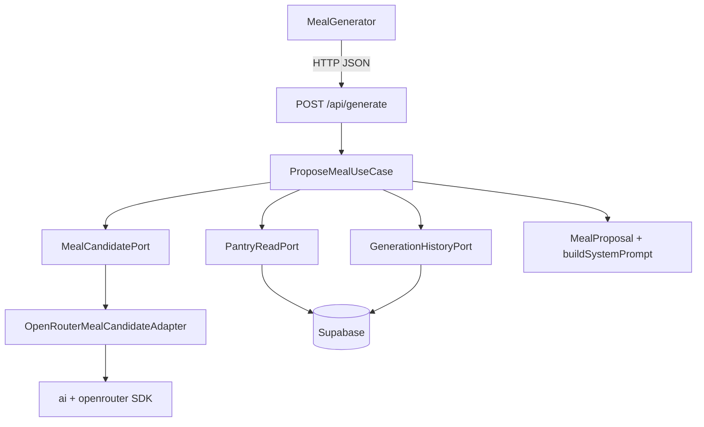

# Plan ACL: izolacja stosu generowania posiłków (AI SDK + OpenRouter)

> Metoda: odkrycie → identyfikacja → klasyfikacja → diagnoza → projekt → weryfikacja.  
> Zakres: **plan only** — bez zmian w kodzie produkcyjnym.  
> Powiązanie: @context/domain/01-domain-distillation.md, @context/domain/02-invariant-aggregate-refactor.md

---

## KROK 0 — Kontekst

### Dokumenty bazowe

| Dokument                                                      | Istotne dla wymienialności                                                                                                                            |
| ------------------------------------------------------------- | ----------------------------------------------------------------------------------------------------------------------------------------------------- |
| `context/foundation/prd.md`                                   | Business Logic: jeden `MealRecipe` z pantry + constraints (`prd.md:175-181`) — **bez** wiązania do dostawcy LLM                                       |
| `context/foundation/tech-stack.md`                            | `has_ai: true`; F-02: OpenRouter via `generation.ts` (`tech-stack.md:19,35`)                                                                          |
| `context/archive/2026-06-01-ai-meal-generation/research.md`   | **Dwie ścieżki integracji:** OpenRouter (fetch) vs Cloudflare Workers AI binding; OpenRouter „avoids Cloudflare-only lock-in” (`research.md:199-206`) |
| `context/archive/2026-06-01-ai-meal-generation/plan-brief.md` | Decyzja SDK: Vercel AI SDK + `@openrouter/ai-sdk-provider`; out of scope: Workers AI binding (`plan-brief.md:32-33,58`)                               |
| `context/archive/2026-06-01-ai-meal-generation/plan.md`       | „No Cloudflare Workers AI binding — OpenRouter is the only provider” (plan) vs research — **rozjazd intencji**                                        |
| `README.md`                                                   | Supabase + Cloudflare Workers; brak wzmianki o OpenRouter w README root                                                                               |

### Stack i zależności zewnętrzne (`package.json`)

| Pakiet                                   | Wersja        | Rola domenowa                                                      |
| ---------------------------------------- | ------------- | ------------------------------------------------------------------ |
| `ai`                                     | ^6.0.193      | Wywołanie LLM (`generateText`, `Output.object`)                    |
| `@openrouter/ai-sdk-provider`            | ^2.9.0        | Provider OpenRouter dla AI SDK                                     |
| `@supabase/supabase-js`, `@supabase/ssr` | ^2.99 / ^0.10 | Auth + Postgres (fundament, nie deklarowany jako wymienialny)      |
| `zod`                                    | ^4.4.3        | Walidacja HTTP wire + **duplikat** schematów LLM w `generation.ts` |
| `astro`, `@astrojs/cloudflare`           | ^6.3 / ^13.5  | SSR, workerd runtime                                               |

### Warstwy kodu

| Warstwa            | Ścieżka                                                              |
| ------------------ | -------------------------------------------------------------------- |
| UI (React island)  | `src/components/meal/MealGenerator.tsx`                              |
| API                | `src/pages/api/generate.ts`                                          |
| „Serwis” (monolit) | `src/lib/generation.ts` — LLM + prompt + walidacja + Supabase INSERT |
| Wire / parse       | `src/lib/generation-schema.ts`, `src/lib/parse-generate-response.ts` |
| Typy współdzielone | `src/types.ts`                                                       |
| Infra auth/DB      | `src/lib/supabase.ts`, migracje SQL                                  |
| Runtime edge       | `cloudflare:workers` w `generate.ts` (rate limit KV)                 |

---

## KROK 1 — Przeciekające zależności

### Metoda skanowania (`src/`, `tests/`)

**Warstwa 1 — tekst (rg):**

```bash
rg -rE "from ['\"]ai['\"]|from ['\"]@openrouter/ai-sdk-provider['\"]" src tests
rg "vi\.mock\([\"']ai[\"']|vi\.mock\([\"']@openrouter/ai-sdk-provider[\"']" tests
```

**Warstwa 2 — AST (ast-grep `sg` 0.43.0):** precyzyjne namierzenie importów, wywołań API i typów w sygnaturach.

```bash
# Importy wartości z SDK (wzorzec: import { $$$ } from $MOD)
sg -p 'import { $$$ } from $MOD' src tests | rg '"(ai|@openrouter/ai-sdk-provider)"'

# Importy typów z SDK — oczekiwany wynik: pusty
sg -p 'import type { $$$ } from $MOD' src tests | rg '"(ai|@openrouter/ai-sdk-provider)"'

# Wywołania API (pojedyncze miejsca w produkcji)
sg -p 'const $VAR = createOpenRouter($$$)' src tests
sg -p 'await generateText($$$)' src tests
sg -p 'Output.object($$$)' src tests
sg -p 'openrouter($$$)' src tests

# Lokalne typy pośrednio sprzężone ze structured output SDK
sg -p 'let $VAR: z.infer<typeof $SCHEMA>' src/lib/generation.ts

# Mocki i coupling testowy
sg -p 'vi.mock($MOD, $$$)' tests | rg '"(ai|@openrouter|astro:env)'
sg -p 'vi.mocked($EXPR)' tests
sg -p 'generateMeal($$$)' src tests
```

**Wynik rg:** dokładnie **2 pliki** z importami SDK.  
**Wynik ast-grep:** potwierdza **izolację warstw powyżej monolitu** (API/UI bez SDK) oraz **koncentrację całego transportu LLM w jednym bloku** `generation.ts:185-205`.

---

### A. Vercel AI SDK + OpenRouter (`ai`, `@openrouter/ai-sdk-provider`)

#### `src/lib/generation.ts` — jedyny plik produkcyjny z importami SDK

| Linia       | Wiedza o infrastrukturze LLM                                                                                                                                                                                                                                                                                                                    |
| ----------- | ----------------------------------------------------------------------------------------------------------------------------------------------------------------------------------------------------------------------------------------------------------------------------------------------------------------------------------------------- |
| **1**       | Decyzja integracyjna: `generateText` + `Output.object` zamiast `generateObject` — lepsza zgodność OpenRouter z AI SDK v5 structured-output API                                                                                                                                                                                                  |
| **2**       | Import `generateText`, `Output` z pakietu `ai` (Vercel AI SDK)                                                                                                                                                                                                                                                                                  |
| **3**       | Import `createOpenRouter` z `@openrouter/ai-sdk-provider`                                                                                                                                                                                                                                                                                       |
| **40-48**   | `GenerationOutputSchema` — kształt structured output wymuszany przez SDK (`no_match` + placeholdery pól); komentarz: strict JSON schema (wszystkie klucze required — ograniczenie OpenAI/Azure)                                                                                                                                                 |
| **185**     | Instancja providera: `createOpenRouter({ apiKey: OPENROUTER_API_KEY })` — klucz z `astro:env/server`                                                                                                                                                                                                                                            |
| **192-205** | Pełne wywołanie transportu LLM: `generateText({ model: openrouter("openai/gpt-4.1-nano", { plugins: [{ id: "response-healing" }], provider: { require_parameters: true } }), output: Output.object({ schema: GenerationOutputSchema, name: "MealRecipeOrNoMatch" }), system, prompt, maxRetries: 0, abortSignal: AbortSignal.timeout(25000) })` |
| **206-213** | Obsługa wyjątków transportu (`catch` na `generateText`) — retry aplikacyjny, potem sentinel DB                                                                                                                                                                                                                                                  |
| **215-224** | Interpretacja pola `no_match` z outputu modelu (logika biznesowa na surowym kształcie SDK)                                                                                                                                                                                                                                                      |

**Co ten plik „wie” łącznie o stosie LLM (poza samymi importami):**

- **Provider:** OpenRouter jako jedyny dostawca (`createOpenRouter`, nie Workers AI binding).
- **Model:** stały identyfikator `openai/gpt-4.1-nano`.
- **OpenRouter-specific:** plugin `response-healing`, flaga `require_parameters: true`.
- **API SDK:** `generateText` + `Output.object` (nie `generateObject`); `maxRetries: 0` (retry tylko w pętli use case).
- **Timeout:** 25 s przez `AbortSignal.timeout`.
- **Kontrakt odpowiedzi:** Zod `GenerationOutputSchema` przekazany do `Output.object` — wiedza o structured output AI SDK.
- **Sekret:** `OPENROUTER_API_KEY` z env serwera.

**Przeciek poza LLM (ten sam moduł):** `SupabaseClient` w sygnaturze (`6,141-144`), osobny `MealRecipeSchema` dla walidacji po LLM (`33-38,227-236`), `buildSystemPrompt` / `COOKING_STAPLES` (`9-94`), walidacja spiżarni (`238-259`), INSERT do `generation_history` (`262-271`).

---

#### `tests/integration/generation-failure-sentinel.test.ts` — jedyny test z wiedzą o SDK

| Linia     | Wiedza o infrastrukturze LLM                                                                                |
| --------- | ----------------------------------------------------------------------------------------------------------- |
| **13-15** | Mock `astro:env/server` — podstawia `OPENROUTER_API_KEY: "test-key"` (wiedza o źródle klucza providera)     |
| **17-22** | `vi.mock("ai")` — stub `generateText` + `Output.object` (wiedza o API SDK używanym w monolicie)             |
| **24-26** | `vi.mock("@openrouter/ai-sdk-provider")` — stub `createOpenRouter` zwracający funkcję modelu `"mock-model"` |
| **28**    | `import { generateText } from "ai"` — import wyłącznie po to, by `vi.mocked(generateText)` wstrzyknąć błąd  |
| **29**    | `import { generateMeal } from "@/lib/generation"` — test woła **monolit**, nie port domenowy                |
| **64**    | `vi.mocked(generateText).mockRejectedValue(...)` — symuluje awarię providera po retry                       |

**Co ten test „wie” o stosie LLM:**

- Zna **nazwy modułów** do mockowania (`ai`, `@openrouter/ai-sdk-provider`) — coupling do implementacji, nie do `MealCandidatePort`.
- Zna **punkt awarii** (`generateText` throw) — nie testuje mapowania outputu ani pluginów OpenRouter.
- Nie weryfikuje `Output.object`, model ID ani `response-healing` — zakłada, że monolit poprawnie je wywołuje.

**Przeciek testowy:** asercja przez `generateMeal(supabase, …)` (`69-72`) łączy mock SDK z persystencją Supabase w jednym scenariuszu — po ACL test powinien mockować `MealCandidatePort`, a use case testować sentinel osobno.

---

#### Podsumowanie przecieku A

| Obszar                                | Pliki dziś                                                  | Docelowo (KROK 4)                                       |
| ------------------------------------- | ----------------------------------------------------------- | ------------------------------------------------------- |
| Import `ai`                           | `generation.ts:2`, `generation-failure-sentinel.test.ts:28` | tylko `src/infrastructure/meal-generation/openrouter/*` |
| Import `@openrouter/ai-sdk-provider`  | `generation.ts:3`                                           | tylko adapter OpenRouter                                |
| Wiedza o modelu / pluginach / timeout | `generation.ts:185-205`                                     | stałe w adapterze                                       |
| Mock SDK w testach                    | `generation-failure-sentinel.test.ts:17-26`                 | fake `MealCandidatePort`                                |

---

### Diagnoza stopnia przecieku infrastruktury → domena (ast-grep)

#### Mapa wywołań API SDK (produkcja)

| Wzorzec `sg`                                                     | Plik:linia              | Znaczenie                                                                                 |
| ---------------------------------------------------------------- | ----------------------- | ----------------------------------------------------------------------------------------- |
| `import { generateText, Output } from "ai"`                      | `generation.ts:2`       | Jedyny import wartości z Vercel AI SDK                                                    |
| `import { createOpenRouter } from "@openrouter/ai-sdk-provider"` | `generation.ts:3`       | Jedyny import z providera OpenRouter                                                      |
| `const openrouter = createOpenRouter({ apiKey: … })`             | `generation.ts:185`     | **1×** fabryka providera w całym `src/`                                                   |
| `openrouter("openai/gpt-4.1-nano", { plugins, provider })`       | `generation.ts:193-196` | **1×** konfiguracja modelu + pluginów OpenRouter                                          |
| `await generateText({ … })`                                      | `generation.ts:192-205` | **1×** wywołanie transportu LLM                                                           |
| `Output.object({ schema, name })`                                | `generation.ts:197-200` | **1×** structured output AI SDK                                                           |
| `let result: z.infer<typeof GenerationOutputSchema>`             | `generation.ts:189`     | Typ lokalny — **semantycznie** sprzężony z `Output.object`, choć bez importu typów z `ai` |

**Wniosek ast-grep:** cały stos SDK jest **skoncentrowany w jednym bloku** wewnątrz `generateMeal` — brak rozproszenia wywołań po `src/`. To ułatwia wycięcie do adaptera, ale podkreśla brak granicy portu.

#### Sygnatury funkcji w `generation.ts` — typy SDK w API modułu?

| Funkcja (export / internal) | Sygnatura (parametry → zwrot)                                             | Typ z `ai` / `@openrouter`? |
| --------------------------- | ------------------------------------------------------------------------- | :-------------------------: |
| `buildSystemPrompt`         | `(string[], MealType, number \| null) → string`                           |           **Nie**           |
| `generateMeal`              | `(SupabaseClient, string, GenerateRequest) → Promise<GenerationResult>`   |           **Nie**           |
| `insertFailureSentinelRow`  | `(SupabaseClient, string, MealType) → Promise<boolean>`                   |           **Nie**           |
| `recordGenerationFailure`   | `(SupabaseClient, string, MealType, unknown) → Promise<GenerationResult>` |           **Nie**           |

**Weryfikacja `sg`:** `import type { $$$ } from $MOD` w `generation.ts` zwraca wyłącznie `SupabaseClient` (`:6`) i typy z `@/types` (`:7`). **Zero** `import type` z `ai` lub `@openrouter/ai-sdk-provider` w całym repo.

**Wniosek:** publiczne API modułu (`generateMeal`, `buildSystemPrompt`) **nie eksponuje typów biblioteki LLM** — przeciek jest **implementacyjny** (ciało funkcji + schemat Zod pod `Output.object`), nie **kontraktowy** (sygnatury).

#### Propagacja w górę i w dół (call graph)

| Wzorzec `sg`                                | Plik:linia                                  | Warstwa                                         |
| ------------------------------------------- | ------------------------------------------- | ----------------------------------------------- |
| `generateMeal($$$)`                         | `src/pages/api/generate.ts:54`              | API — coupling do monolitu, **bez** importu SDK |
| `generateMeal($$$)`                         | `generation-failure-sentinel.test.ts:69-72` | Test — coupling do monolitu + mock SDK          |
| `vi.mock("ai", …)`                          | `generation-failure-sentinel.test.ts:17-22` | Test zna moduł `ai`, nie port                   |
| `vi.mock("@openrouter/ai-sdk-provider", …)` | `generation-failure-sentinel.test.ts:24-26` | Test zna provider OpenRouter                    |
| `vi.mocked(generateText)`                   | `generation-failure-sentinel.test.ts:64`    | Test wstrzykuje błąd na poziomie SDK            |

**Wniosek:** UI i `generate.ts` są **czyste** w sensie importów SDK; przeciek propaguje się wyłącznie przez **`generateMeal`** jako fałszywy „use case”.

#### Ocena stopnia przecieku (skala 0–5, wyżej = gorzej)

| Wymiar                                    |  Ocena   | Uzasadnienie (ast-grep)                                                                                 |
| ----------------------------------------- | :------: | ------------------------------------------------------------------------------------------------------- |
| Importy SDK w `src/` poza adapterem       | **5/5**  | 2 linie importu w jednym pliku — cały produkcyjny konsument                                             |
| Typy SDK w sygnaturach export             | **0/5**  | Brak `import type` z SDK; `generateMeal` używa `@/types` + `SupabaseClient`                             |
| Rozproszenie wywołań API                  | **1/5**  | 1× `createOpenRouter`, 1× `generateText`, 1× `Output.object` — łatwe do wycięcia                        |
| Colocation infra + domena + DB            | **5/5**  | Ten sam plik: SDK (`185-205`), prompt (`56-94`), pantry (`238-259`), Supabase (`263-271`)               |
| Coupling pośredni (Zod ↔ `Output.object`) | **4/5**  | `GenerationOutputSchema` + `z.infer` (`189`) — kształt pod AI SDK, nie pod domenę                       |
| Testy                                     | **4/5**  | Mock modułów `ai`/`@openrouter`, nie `MealCandidatePort`                                                |
| **Średnia ważona (ACL #1)**               | **~4/5** | Granica **kontraktowa** częściowo zachowana (sygnatury), granica **architektoniczna** zerwana (monolit) |

**Diagnoza jednym zdaniem:** ast-grep potwierdza **„ukryty monolit”** — SDK nie wynika na zewnątrz przez typy, ale **cała wiedza transportowa i mapowania `no_match` żyje wewnątrz `generateMeal`**, obok reguł domenowych i Supabase. ACL powinien przenieść blok `185-205` + `GenerationOutputSchema` do adaptera, zostawiając w domenie wyłącznie `MealCandidateResult`.

---

### B. Zod — wire + LLM output (duplikacja kształtu przepisu)

| Plik                                                          | Linia     | Co „wie”                                                                        |
| ------------------------------------------------------------- | --------- | ------------------------------------------------------------------------------- |
| `src/lib/generation-schema.ts`                                | 1, 3-29   | Schematy HTTP request/response (`generateRequestSchema`, `mealRecipeSchema`, …) |
| `src/lib/generation.ts`                                       | 4, 33-48  | **Osobne** `MealRecipeSchema`, `GenerationOutputSchema` dla LLM                 |
| `src/pages/api/generate.ts`                                   | 4, 45     | `generateRequestSchema`                                                         |
| `src/pages/api/favorites/index.ts`                            | 3, 10     | `mealRecipeSchema`                                                              |
| `src/lib/parse-generate-response.ts`                          | 10, 22-39 | Import schematów Zod — **ścieżka klienta** (`MealGenerator.tsx:16`)             |
| `src/types.ts`                                                | 42-43     | `@deprecated` — wire type z `generation-schema` w pliku typów domenowych        |
| `src/lib/pantry-name.ts`                                      | 1         | Zod nazwy spiżarni (osobny bounded context)                                     |
| `src/pages/api/pantry/*.ts`, `auth/*.ts`, `favorites/[id].ts` | 2         | Zod walidacji wejścia API                                                       |

---

### C. Supabase (`@supabase/ssr`, `@supabase/supabase-js`)

| Plik                               | Linia                                | Co „wie”                                                                                       |
| ---------------------------------- | ------------------------------------ | ---------------------------------------------------------------------------------------------- |
| `src/lib/supabase.ts`              | 1, 11                                | `createServerClient` z `@supabase/ssr`                                                         |
| `src/lib/supabase-browser.ts`      | 1, 4                                 | `createBrowserClient` (**nieużywany** poza definicją)                                          |
| `src/lib/generation.ts`            | 6, 99-111, 129-136, 141-150, 263-271 | Typ `SupabaseClient` w sygnaturze + `.from("pantry_products")` / `.from("generation_history")` |
| `src/middleware.ts`                | 2, 11                                | `createClient`                                                                                 |
| `src/pages/api/generate.ts`        | 3, 33                                | `createClient` → przekazanie do `generateMeal`                                                 |
| `src/pages/api/pantry/index.ts`    | 4, 19, 43                            | `.from("pantry_products")`                                                                     |
| `src/pages/api/pantry/[id].ts`     | 4, 19, 66                            | j.w.                                                                                           |
| `src/pages/api/favorites/index.ts` | 4, 20, 44                            | `.from("favorite_meals")`                                                                      |
| `src/pages/api/favorites/[id].ts`  | 3, 15                                | j.w.                                                                                           |
| `src/pages/api/auth/signin.ts`     | 3, 32                                | auth API                                                                                       |
| `src/pages/api/auth/signup.ts`     | 3, 38                                | j.w.                                                                                           |
| `src/pages/api/auth/signout.ts`    | 2, 7                                 | j.w.                                                                                           |
| `src/pages/dashboard.astro`        | 5, 14-18                             | prefetch spiżarni                                                                              |
| `src/pages/favorites.astro`        | 5, 8+                                | prefetch ulubionych                                                                            |

---

### D. Cloudflare Workers runtime (`cloudflare:workers`)

| Plik                        | Linia    | Co „wie”                    |
| --------------------------- | -------- | --------------------------- |
| `src/pages/api/generate.ts` | 2, 14-17 | `env.RATE_LIMIT` KV binding |

---

## KROK 2 — Klasyfikacja i wybór #1

Skala 1–5 (wyżej = gorzej / ważniejszy sygnał).

| Zależność                     |                                      (a) Warstwy/pliki                                      |                        (b) Koszt wymiany dziś                        |                                 (c) Deklarowana wymienialność                                  | Ocena                |
| ----------------------------- | :-----------------------------------------------------------------------------------------: | :------------------------------------------------------------------: | :--------------------------------------------------------------------------------------------: | -------------------- |
| **A. AI SDK + OpenRouter**    | 3 warstwy logicznie (API→monolit→test), **1 plik produkcyjny** ale monolit dotyka DB+domain | **5** — wymiana providera = edycja `generation.ts` z pantry/historią | **5** — research explicite: OpenRouter vs Workers AI, unikanie lock-in (`research.md:199-206`) | **#1**               |
| B. Zod (wire + LLM duplicate) |                                 **8+ plików** API + klient                                  |                3 — Zod v4 pinned; duplikat schematów                 |                                  1 — brak deklaracji wymiany                                   | #2 pomocniczy        |
| C. Supabase                   |                                       **15+ plików**                                        |                        5 — głęboka integracja                        |                            1 — fundament stacku, nie do swapu w MVP                            | poza ACL             |
| D. cloudflare:workers KV      |                                           1 plik                                            |                         2 — tylko rate limit                         |                          3 — Workers AI jako alternatywa LLM, nie KV                           | osobny adapter infra |

### Wybór #1: **A — stos `ai` + `@openrouter/ai-sdk-provider` (Meal Candidate)**

**Uzasadnienie:** Dokumentacja planistyczna traktuje **dostawcę LLM jako decyzję zewnętrzną** z co najmniej dwiema ścieżkami (OpenRouter vs Workers AI binding, `research.md:199-206`), a jednocześnie cała wiedza o kształcie odpowiedzi modelu, pluginach (`response-healing`, `require_parameters`, `generation.ts:192-196`), timeout (`204`) i mapowaniu `no_match` siedzi w **`generation.ts` razem z Supabase i walidacją spiżarni**. Wymiana OpenRouter → Workers AI / inny provider dziś wymaga chirurgii w monolicie, nie wymiany adaptera. Test integracyjny mockuje `ai` i `@openrouter` (`generation-failure-sentinel.test.ts:17-29`), ale nadal woła `generateMeal` — **coupling testów do implementacji**, nie do portu. Rozjazd plan vs research (plan wyklucza Workers AI, research go promuje) ujawnia brak stabilnej granicy — idealny kandydat na ACL.

---

## KROK 3 — Diagnoza #1

### Duplikacja kształtu przepisu (Zod ×2 + TypeScript)

**Ten sam koncept `MealRecipe` zdefiniowany niezależnie:**

```33:38:src/lib/generation.ts
const MealRecipeSchema = z.object({
  name: z.string().min(1),
  prep_time_minutes: z.number().int().positive(),
  ingredients: z.array(z.string().min(1)).min(1),
  steps: z.array(z.string().min(1)).min(1),
});
```

```10:15:src/lib/generation-schema.ts
export const mealRecipeSchema = z.object({
  name: z.string().min(1).max(200),
  prep_time_minutes: z.number().int().positive().max(480),
  ingredients: z.array(z.string().min(1).max(500)).min(1).max(50),
  steps: z.array(z.string().min(1).max(500)).min(1).max(30),
});
```

```3:8:src/types.ts
export interface MealRecipe {
  name: string;
  prep_time_minutes: number;
  ingredients: string[];
  steps: string[];
}
```

**Skutek:** adapter LLM waliduje innymi limitami niż API favorites / wire — drift kontraktu bez jednego źródła prawdy.

### Przeciek przez granice warstw

| Granica                     | Problem                                                            | Dowód (ast-grep / rg)                                                     |
| --------------------------- | ------------------------------------------------------------------ | ------------------------------------------------------------------------- |
| Infra LLM → „serwis”        | Brak portu; SDK wołany inline w jednym bloku                       | `sg await generateText` → tylko `generation.ts:192-205`                   |
| Infra LLM → persystencja    | `SupabaseClient` w tej samej funkcji co `generateText`             | `generateMeal` sygnatura `:141-144`; `sg generateMeal` → `generate.ts:54` |
| Infra LLM → domena          | `buildSystemPrompt` + `COOKING_STAPLES` w pliku z importami SDK    | import `ai` `:2` w tym samym module co `buildSystemPrompt` `:56`          |
| Kontrakt SDK → typy lokalne | `GenerationOutputSchema` pod `Output.object`, nie pod domenę       | `sg let $VAR: z.infer` → `generation.ts:189,227`                          |
| API → monolit               | Route woła `generateMeal`, nie port                                | `sg generateMeal` → `generate.ts:54` — brak importu SDK w API             |
| Test → monolit              | Mock modułów SDK + assert przez `generateMeal`                     | `sg vi.mock("ai")` `:17`; `sg vi.mocked(generateText)` `:64`              |
| Sygnatury export            | **Pozytyw:** brak typów `ai`/`@openrouter` w publicznym API modułu | `sg import type` w `generation.ts` — tylko `SupabaseClient`, `@/types`    |

### Deklaracja wymienialności vs kod

**Dokument mówi:**

> „OpenRouter (external fetch) aligns with `infrastructure.md` and **avoids Cloudflare-only lock-in**.”  
> — `context/archive/2026-06-01-ai-meal-generation/research.md:206`

> „**Cloudflare Workers AI binding** … No external API key … Limited model selection; **Cloudflare-only**”  
> — `context/archive/2026-06-01-ai-meal-generation/research.md:203-204`

**Kod robi:** twardo wiąże orchestrację z OpenRouter AI SDK w jednym module — wymiana na Workers AI wymaga przepisania `generation.ts`, nie podmiany adaptera.

### Połykanie błędów (fail-soft zamiast fail-fast na granicy ACL)

| Miejsce                                             | Zachowanie                                 | Dowód                       |
| --------------------------------------------------- | ------------------------------------------ | --------------------------- |
| LLM exception po retry                              | Log + sentinel DB + `{ status: "error" }`  | `generation.ts:212,128-137` |
| Pantry violation po retry                           | `console.warn` → `no_match` (OK biznesowo) | `generation.ts:254-259`     |
| Brak mapowania błędu transportu LLM na typ domenowy | `unknown` w catch                          | `generation.ts:207-212`     |

ACL powinien mapować błędy transportu na **`MealCandidateUnavailableError`** w adapterze; orchestrator decyduje o retry/`error` — bez importu `ai`.

**Klient nie bundluje `ai`** (dobrze), ale bundluje Zod wire przez `parse-generate-response.ts:10` — to osobny przeciek (B), poza #1.

---

## KROK 4 — Projekt ACL

### Struktura katalogów (docelowa)

```
src/domain/meal-generation/
  MealProposal.ts              ← value object (jedyne miejsce kształtu domenowego przepisu)
  MealCandidateRequest.ts      ← constraints + pantry names + exclude names
  MealCandidateResult.ts       ← discriminated union (proposal | no_match | unavailable)
  errors.ts                    ← MealCandidateUnavailableError, …
  ports/
    MealCandidatePort.ts       ← wąski interfejs

src/infrastructure/meal-generation/
  openrouter/
    OpenRouterMealCandidateAdapter.ts   ← JEDYNY plik: import 'ai', '@openrouter/ai-sdk-provider'
    mapOpenRouterOutput.ts              ← surowy output → MealCandidateResult
  workers-ai/                           ← (faza opcjonalna) WorkersAiMealCandidateAdapter.ts

src/application/
  ProposeMealUseCase.ts        ← orchestracja: pantry read → port → walidacja domenowa → history

src/lib/generation.ts          ← DEPRECATED → usunięty po migracji (lub cienki re-export)
```

### Value object: `MealProposal` (jedyne miejsce wiedzy o kształcie)

```typescript
// src/domain/meal-generation/MealProposal.ts

export interface MealProposalProps {
  name: string;
  prepTimeMinutes: number;
  ingredients: readonly string[];
  steps: readonly string[];
}

export class MealProposal {
  private constructor(private readonly props: MealProposalProps) {}

  /** Z persystencji JSONB (generation_history, favorite_meals) — bez Zod SDK. */
  static fromPersistence(raw: unknown): MealProposal {
    // walidacja minimalna pól wymaganych przez DB CHECK (migration 20260528120000:46-53)
    // rzuca MealProposalInvalidError jeśli kształt zły
  }

  /** Z zaufanego wyniku portu (już zmapowanego w adapterze). */
  static create(props: MealProposalProps): MealProposal {
    if (props.prepTimeMinutes <= 0) throw new MealProposalInvalidError("PREP_TIME");
    if (props.ingredients.length === 0) throw new MealProposalInvalidError("INGREDIENTS");
    return new MealProposal(props);
  }

  /** Do wire HTTP / Supabase JSON — jedyne mapowanie snake_case. */
  toWire(): { name: string; prep_time_minutes: number; ingredients: string[]; steps: string[] } {
    return {
      name: this.props.name,
      prep_time_minutes: this.props.prepTimeMinutes,
      ingredients: [...this.props.ingredients],
      steps: [...this.props.steps],
    };
  }

  get name(): string {
    return this.props.name;
  }
  get prepTimeMinutes(): number {
    return this.props.prepTimeMinutes;
  }
  // …
}
```

**Reguła:** `MealRecipe` w `src/types.ts` staje się typem **wire/DTO** (alias `MealProposalWire`) lub znika na rzecz `toWire()` — **typy biblioteki Zod/AI nigdy w sygnaturach domenowych**.

### Wąski port domenowy

```typescript
// src/domain/meal-generation/ports/MealCandidatePort.ts

export interface MealCandidateRequest {
  constraints: {
    mealType: "breakfast" | "lunch" | "dinner";
    maxPrepTimeMinutes: number | null;
    excludeNames: readonly string[];
  };
  pantryProductNames: readonly string[];
  systemPrompt: string; // budowany przez domenę (buildSystemPrompt bez SDK)
  userMessage: string;
}

export type MealCandidateResult =
  | { kind: "proposal"; proposal: MealProposal }
  | { kind: "no_match" } // model explicite no_match
  | { kind: "unavailable"; cause?: unknown }; // timeout, 5xx, malformed

export interface MealCandidatePort {
  requestCandidate(input: MealCandidateRequest): Promise<MealCandidateResult>;
}
```

### Adapter OpenRouter (jedyna wiedza o SDK)

```typescript
// src/infrastructure/meal-generation/openrouter/OpenRouterMealCandidateAdapter.ts
// IMPORTY 'ai' i '@openrouter/ai-sdk-provider' TYLKO TUTAJ

import { generateText, Output } from "ai";
import { createOpenRouter } from "@openrouter/ai-sdk-provider";

/** Decyzje zakodowane w ACL (z research + generation.ts:1,192-204): */
const MODEL_ID = "openai/gpt-4.1-nano";
const PLUGINS = [{ id: "response-healing" }];
const REQUIRE_PARAMETERS = true;
const TIMEOUT_MS = 25_000;

export class OpenRouterMealCandidateAdapter implements MealCandidatePort {
  constructor(private readonly apiKey: string) {}

  async requestCandidate(input: MealCandidateRequest): Promise<MealCandidateResult> {
    const openrouter = createOpenRouter({ apiKey: this.apiKey });
    try {
      const { output } = await generateText({
        model: openrouter(MODEL_ID, {
          plugins: PLUGINS,
          provider: { require_parameters: REQUIRE_PARAMETERS },
        }),
        output: Output.object({ schema: OpenRouterOutputSchema, name: "MealRecipeOrNoMatch" }),
        system: input.systemPrompt,
        prompt: input.userMessage,
        maxRetries: 0,
        abortSignal: AbortSignal.timeout(TIMEOUT_MS),
      });
      return mapOpenRouterOutput(output); // → MealProposal | no_match | unavailable
    } catch (cause) {
      throw new MealCandidateUnavailableError(cause); // fail-fast na granicy adaptera
    }
  }
}
```

```typescript
// mapOpenRouterOutput.ts — pseudokod
function mapOpenRouterOutput(raw: OpenRouterOutput): MealCandidateResult {
  if (raw.no_match) return { kind: "no_match" };
  try {
    return { kind: "proposal", proposal: MealProposal.create({ ... }) };
  } catch {
    return { kind: "unavailable" }; // lub throw — zależnie od polityki retry w use case
  }
}
```

**`buildSystemPrompt` / `COOKING_STAPLES`:** przeniesione do `src/domain/meal-generation/` (bez importów SDK) — domena dostarcza tekst; adapter tylko przekazuje do LLM.

### Use case (reszta kodu zna tylko port)

```typescript
// src/application/ProposeMealUseCase.ts — pseudokod

async propose(userId, command, deps: {
  pantryRead: PantryReadPort,
  candidates: MealCandidatePort,
  history: GenerationHistoryPort,
}): Promise<GenerationOutcome> {
  const names = await deps.pantryRead.listProductNames(userId);
  if (names.length === 0) return { outcome: "no_match" };

  const systemPrompt = buildSystemPrompt(names, command.mealType, command.maxPrepTime);
  const userMessage = buildUserMessage(command.excludeNames);

  for (let attempt = 1; attempt <= 2; attempt++) {
    const result = await deps.candidates.requestCandidate({ ... });
    if (result.kind === "no_match") return { outcome: "no_match" };
    if (result.kind === "unavailable") {
      if (attempt < 2) continue;
      throw new MealCandidateUnavailableError(result.cause);
    }
    // domena: INV-PANTRY, INV-TIME (patrz 02-invariant-aggregate-refactor.md)
    aggregate.acceptCandidate(result.proposal);
    const wire = aggregate.commit().toWire();
    const historyId = await deps.history.insertSuccess(userId, wire, command.mealType);
    return { outcome: "success", recipe: wire, historyId };
  }
}
```

### Cienkie API

```typescript
// src/pages/api/generate.ts — after
const outcome = await proposeMealUseCase.propose(user.id, parsed.data, {
  candidates: openRouterAdapter, // wstrzykiwany singleton / factory
  ...
});
// mapowanie outcome → JSON; brak importu 'ai'
```

---

## KROK 5 — Dowód izolacji + before/after

### Kryterium sukcesu (grep + ast-grep)

Po refaktorie:

```bash
rg "from ['\"]ai['\"]|from ['\"]@openrouter/ai-sdk-provider['\"]" src/
sg -p 'import { $$$ } from $MOD' src | rg '"(ai|@openrouter/ai-sdk-provider)"'
sg -p 'await generateText($$$)' src
sg -p 'createOpenRouter($$$)' src
```

**Oczekiwany wynik:** wyłącznie pliki w `src/infrastructure/meal-generation/openrouter/`; `sg await generateText` i `sg createOpenRouter` — **0 trafień** poza adapterem.

| Plik                                                       | Zna `ai` / `@openrouter` dziś |                      Po refaktorze                       |
| ---------------------------------------------------------- | :---------------------------: | :------------------------------------------------------: |
| `src/lib/generation.ts`                                    |       ✓ (`2-3,185-205`)       |                   ✗ usunięty / bez SDK                   |
| `src/pages/api/generate.ts`                                |               ✗               |                            ✗                             |
| `src/components/meal/MealGenerator.tsx`                    |               ✗               |           ✗ — dostaje `MealRecipe` wire z JSON           |
| `src/lib/generation-schema.ts`                             |               ✗               | ✗ — tylko HTTP (opcjonalnie przeniesiony do `src/wire/`) |
| `src/infrastructure/.../OpenRouterMealCandidateAdapter.ts` |               —               |                       ✓ **jedyne**                       |
| `tests/integration/generation-failure-sentinel.test.ts`    |          ✓ mock SDK           |          mock **`MealCandidatePort`**, nie `ai`          |

### Before / after — zduplikowane miejsca

| Miejsce          | Before                                                                          | After                                                                                  |
| ---------------- | ------------------------------------------------------------------------------- | -------------------------------------------------------------------------------------- |
| Kształt przepisu | 3 definicje (`types.ts`, `generation-schema.ts`, `generation.ts:33-38`)         | 1 VO `MealProposal` + opcjonalny Zod **tylko** na wire w `src/wire/generate.ts`        |
| Wywołanie LLM    | `generation.ts:192-205`                                                         | `OpenRouterMealCandidateAdapter.requestCandidate`                                      |
| Prompt           | `generation.ts:56-94`                                                           | `src/domain/meal-generation/buildSystemPrompt.ts` (bez SDK)                            |
| Test sentinel    | Mock `ai` + import `generateMeal` (`generation-failure-sentinel.test.ts:17-29`) | Fake `MealCandidatePort` + test `ProposeMealUseCase`                                   |
| UI               | `parseGenerateResponse` + Zod (`parse-generate-response.ts:10`)                 | TypeScript wire types / ręczny narrow — **bez** importu schematów serwerowych (faza B) |

### UI dostaje domenę, nie SDK

**Before:** `MealGenerator.tsx:167-197` — `fetch` → `parseGenerateResponse` → `MealRecipe`.

**After:** bez zmiany UX — nadal JSON wire; **`MealRecipe` to DTO z `MealProposal.toWire()`**, nie typ zwracany przez AI SDK. UI **nigdy** nie widzi `GenerationOutputSchema` ani `Output.object`.

---

### Rozstrzygnięcie otwartych pytań (kontrakt biblioteki)

| Pytanie                                              | Źródło                                          | Decyzja ACL                                                                    | Gdzie zakodować                                      |
| ---------------------------------------------------- | ----------------------------------------------- | ------------------------------------------------------------------------------ | ---------------------------------------------------- |
| `generateText` + `Output.object` vs `generateObject` | Komentarz `generation.ts:1` — compat OpenRouter | **Zachować** w OpenRouter adapterze do weryfikacji na workerd                  | `OpenRouterMealCandidateAdapter.ts` nagłówek + stałe |
| Response Healing plugin                              | `generation.ts:194`                             | Włączone dla OpenRouter                                                        | stała `PLUGINS` w adapterze                          |
| Workers AI vs OpenRouter                             | `research.md:199-206`                           | **Port wspólny**; Workers AI = drugi adapter, ten sam `MealCandidatePort`      | `WorkersAiMealCandidateAdapter.ts` (faza opcjonalna) |
| Model ID `openai/gpt-4.1-nano`                       | `generation.ts:193`                             | Konfiguracja adaptera, nie domeny                                              | env / stała w adapterze                              |
| Structured output schema (`no_match` + placeholders) | `generation.ts:40-48,71-76`                     | **`OpenRouterOutputSchema` tylko w infra**; mapowanie na `MealCandidateResult` | `mapOpenRouterOutput.ts`                             |

---

## KROK 6 — Plan faz (konwencja projektu)

Zgodnie z `AGENTS.md`: Vitest (`pnpm test`), integracja Supabase w Tier 2, workerd via `pnpm run build && pnpm run preview`, Conventional Commits.

| Faza   | Cel                                                                                      |                                             Test-first                                             | Deliverables                                                  |
| ------ | ---------------------------------------------------------------------------------------- | :------------------------------------------------------------------------------------------------: | ------------------------------------------------------------- |
| **F1** | Wydzielić `MealProposal`, `MealCandidatePort`, `MealCandidateResult`, błędy domenowe     | **Tak** — `tests/unit/meal-proposal.test.ts`, `tests/unit/meal-candidate-port.test.ts` (fake port) | `src/domain/meal-generation/*`                                |
| **F2** | Przenieść `buildSystemPrompt`, `COOKING_STAPLES`, `buildUserMessage` do domeny (bez SDK) |                               **Tak** — snapshot/purity test promptu                               | `src/domain/meal-generation/buildSystemPrompt.ts`             |
| **F3** | Implementacja `OpenRouterMealCandidateAdapter` + `mapOpenRouterOutput`                   |                        **Tak** — unit z fixture JSON (bez live OpenRouter)                         | `src/infrastructure/meal-generation/openrouter/*`             |
| **F4** | `ProposeMealUseCase` zastępuje `generateMeal`; API inject adapter                        |               **Tak** — refactor `generation-failure-sentinel.test.ts` na fake port                | `src/application/ProposeMealUseCase.ts`, cienki `generate.ts` |
| **F5** | Usunąć SDK z `src/lib/generation.ts`; grep guard w CI                                    |                **Tak** — skrypt `scripts/check-ai-imports.mjs` lub rg w `pnpm test`                | cleanup                                                       |
| **F6** | (Opcjonalnie) `WorkersAiMealCandidateAdapter` — dowód wymienialności                     |                                         Integracja workerd                                         | `src/infrastructure/meal-generation/workers-ai/*`             |

**Test plan alignment:** realizuje Phase 3 test-planu (`test-plan.md:72`) — mocked OpenRouter **przez port**, nie przez mock modułu `ai` w teście use case.

### Przypadki testowe portu / adaptera

| #   | Scenariusz                           | Oczekiwany `MealCandidateResult`                                      |
| --- | ------------------------------------ | --------------------------------------------------------------------- |
| P1  | Output `{ no_match: true, … }`       | `{ kind: "no_match" }`                                                |
| P2  | Output valid recipe JSON             | `{ kind: "proposal", proposal: MealProposal }`                        |
| P3  | `generateText` throws timeout        | `MealCandidateUnavailableError` (adapter)                             |
| P4  | Output missing `ingredients`         | `{ kind: "unavailable" }` lub throw — **fail-fast**, bez success wire |
| P5  | Swap adaptera w use case (fake port) | `ProposeMealUseCase` identyczny — **bez** importu `ai`                |

### Load-bearing names (rejestr kontraktów)

| Symbol                                         | Warstwa                                      |
| ---------------------------------------------- | -------------------------------------------- |
| `MealProposal`                                 | Domain VO — kształt przepisu                 |
| `MealCandidatePort`                            | Domain port                                  |
| `MealCandidateRequest` / `MealCandidateResult` | Domain DTO                                   |
| `MealCandidateUnavailableError`                | Domain / adapter boundary                    |
| `OpenRouterMealCandidateAdapter`               | Infra — jedyny konsument `ai`                |
| `mapOpenRouterOutput`                          | Infra — mapowanie SDK → domain               |
| `ProposeMealUseCase`                           | Application — orchestracja                   |
| `OpenRouterOutputSchema`                       | Infra — **nie** eksportować do domain/API/UI |

---

## Diagram (after)



**Granica ACL:** `MealCandidatePort` oddziela domenę/aplikację od `ai` / `@openrouter/ai-sdk-provider`. Supabase pozostaje za `PantryReadPort` / `GenerationHistoryPort` (osobny ACL w przyszłości — poza #1).

---

## Ograniczenia planu

- Nie obejmuje pełnego ACL dla Supabase (15+ plików) — fundament stacku, nie deklarowany jako wymienialny.
- Faza B (Zod na kliencie w `parse-generate-response.ts:10`) może iść równolegle — osobny refactor wire DTO.
- Weryfikacja workerd wymaga `pnpm run build && pnpm run preview` po F3 (`AGENTS.md`).
